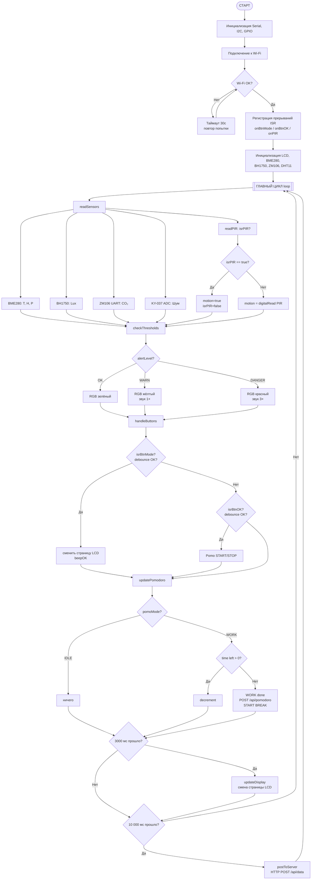
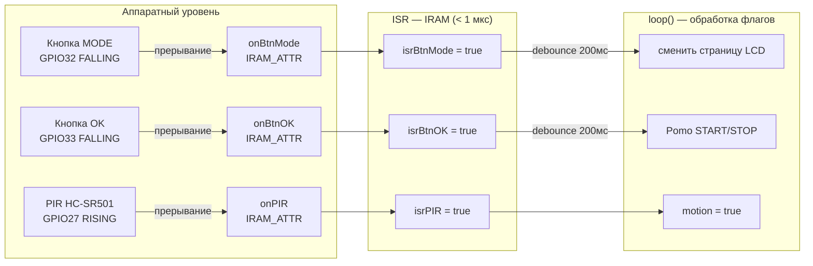
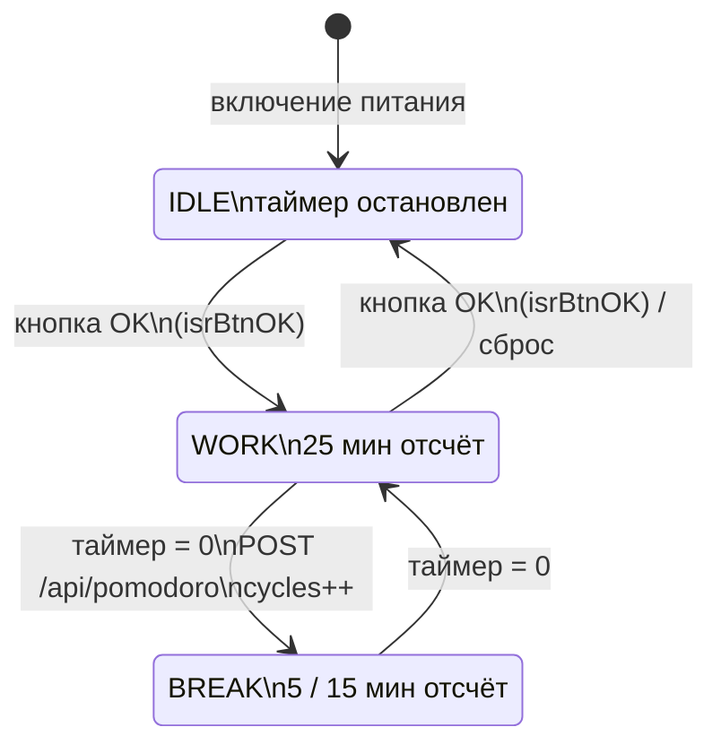
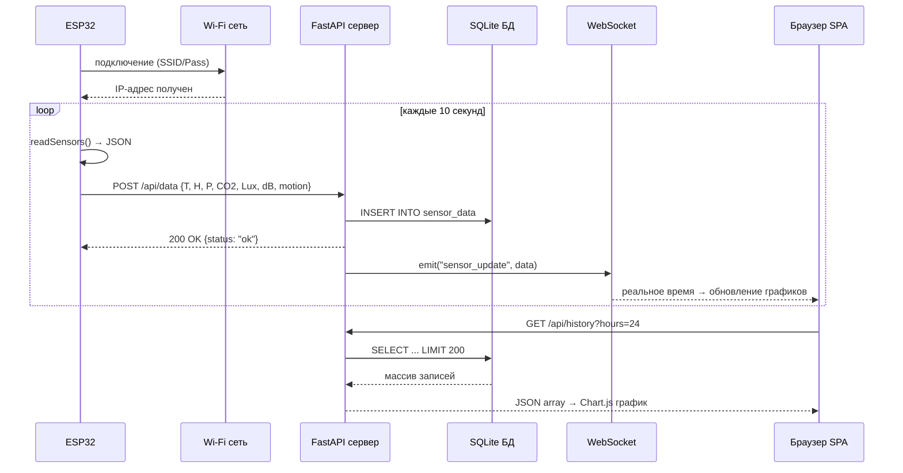

<!--
  ╔══════════════════════════════════════════════════════════════╗
  ║  ИНСТРУКЦИЯ ПО ОФОРМЛЕНИЮ В WORD                            ║
  ║  Шрифт: Times New Roman 14pt                                ║
  ║  Интервал: полуторный (1.5)                                 ║
  ║  Поля: Лево 35мм, Право 10мм, Верх/Низ 20мм                ║
  ║  Абзацный отступ: 1.25 см                                   ║
  ║  Нумерация страниц: сверху справа, начало со стр.2          ║
  ║  Заголовки глав: ПРОПИСНЫМИ, полужирным, по центру          ║
  ╚══════════════════════════════════════════════════════════════╝
-->

---

# ТИТУЛЬНЫЙ ЛИСТ

**НАО «Евразийский национальный университет имени Л.Н. Гумилёва»**

Факультет информационных технологий

Кафедра компьютерной и программной инженерии

---

**КУРСОВАЯ РАБОТА**

по дисциплине **PM3304 «Программирование микроконтроллеров»**

---

**Тема:** «Разработка интеллектуальной IoT-станции мониторинга здоровья на рабочем месте на базе микроконтроллера ESP32»

---

Образовательная программа: **6B06104 — Вычислительная техника и программное обеспечение**

---

Выполнил(а): студент(ка) ___________ курса, группы ___________

Ф.И.О.: ___________________________________________________

---

Проверил(а): Байдельдинов М.У., к.т.н., и.о. доцента

Члены комиссии: ________________________

                ________________________

---

Оценка: ________________ (______________)

Дата защиты: «____» _______________ 2026 г.

Подпись руководителя: _______________________

---

**Астана, 2026**

---

---

# ЗАДАНИЕ НА КУРСОВОЙ ПРОЕКТ

**НАО «Евразийский национальный университет имени Л.Н. Гумилёва»**

Кафедра компьютерной и программной инженерии

Дисциплина: **PM3304 «Программирование микроконтроллеров»**

---

Студенту: ___________________________________________________

Группа: _______________

**Тема проекта:** «Разработка интеллектуальной IoT-станции мониторинга здоровья на рабочем месте на базе микроконтроллера ESP32»

---

**Теоретическая часть проекта. Перечень вопросов, подлежащих разработке:**

Введение

1. Концепция IoT и анализ существующих решений; выбор и обоснование аппаратной платформы ESP32 и датчиков; протоколы передачи данных; стек веб-технологий
2. Проектирование и реализация системы: аппаратная схема, прошивка ESP32 (C++/Arduino), веб-дашборд (FastAPI + SQLite + Socket.IO)
3. Тестирование системы (модульное, интеграционное, нагрузочное) и экономическое обоснование

Заключение

Список литературы

Приложения

---

**Срок сдачи работы студентом:** ______________ 2026 г.

Руководитель работы _________________________ / Байдельдинов М.У. /

Студент _____________________________________ / _____________________ /

---

---

# СОДЕРЖАНИЕ

Введение ............................................................................................3

**ГЛАВА 1. ТЕОРЕТИЧЕСКИЕ ОСНОВЫ МОНИТОРИНГА МИКРОКЛИМАТА НА БАЗЕ IoT**

1.1 Концепция «Интернета вещей» и мониторинга параметров здоровья...6

1.2 Анализ существующих решений на рынке ..........................................8

1.3 Микроконтроллер ESP32: архитектура и возможности.......................10

1.4 Технические характеристики датчиков .............................................12

1.5 Техника Pomodoro как метод управления продуктивностью ..............16

1.6 Протоколы передачи данных во встроенных системах ......................17

1.7 Стек технологий веб-дашборда .......................................................19

**ГЛАВА 2. ПРОЕКТИРОВАНИЕ И РЕАЛИЗАЦИЯ СИСТЕМЫ NEXIS WELLNESS STATION**

2.1 Требования к системе ....................................................................21

2.2 Архитектура системы......................................................................23

2.3 Аппаратная часть устройства .........................................................25

2.4 Программная реализация прошивки ESP32 .....................................28

2.5 Веб-дашборд на FastAPI .................................................................32

2.6 Интегральная метрика качества рабочей среды (Wellness Index) ......36

**ГЛАВА 3. ТЕСТИРОВАНИЕ И РЕЗУЛЬТАТЫ**

3.1 Методология тестирования .............................................................38

3.2 Модульное тестирование ................................................................40

3.3 Интеграционное и функциональное тестирование ...........................42

3.4 Нагрузочное тестирование ..............................................................44

3.5 Экономическое обоснование ...........................................................45

Заключение ........................................................................................47

Список использованной литературы ...................................................49

Приложения.........................................................................................51

---

---

# ВВЕДЕНИЕ

Настоящая курсовая работа посвящена разработке IoT-станции мониторинга здоровья и продуктивности на рабочем месте на базе микроконтроллера ESP32. Под IoT-системой мониторинга понимается комплекс взаимосвязанных аппаратных и программных средств, обеспечивающих непрерывный сбор физических параметров окружающей среды с последующей передачей, хранением и визуализацией данных в реальном времени. Область исследования охватывает методы интеграции встраиваемых систем с веб-технологиями, алгоритмы обработки сигналов датчиков и принципы проектирования IoT-устройств, ориентированных на повышение качества условий труда специалистов умственного труда.

## Актуальность темы

В современном мире всё большее число людей занято умственным трудом, связанным с длительным нахождением за рабочим местом. По данным Всемирной организации здравоохранения (ВОЗ), офисные работники проводят в сидячем положении более восьми часов в сутки, что влечёт за собой целый ряд серьёзных последствий для здоровья. Так, у 65% офисных работников диагностируются заболевания опорно-двигательного аппарата, вызванные гиподинамией; 76% специалистов в сфере информационных технологий испытывают профессиональное выгорание. Исследования Гарвардской школы общественного здравоохранения (COGfx Study, 2015) установили, что повышение концентрации углекислого газа (CO₂) в помещении выше 1000 ppm снижает когнитивные способности сотрудников на 50%. Неправильное освещение рабочего места (менее 300 люкс) приводит к усталости глаз у 80% пользователей персональных компьютеров.

Параллельно с этим специалисты в области тайм-менеджмента фиксируют повсеместное снижение концентрации внимания в связи с постоянными цифровыми отвлечениями. Согласно данным Американского психологического общества (APA), средняя продолжительность сосредоточенной работы у современного офисного работника не превышает 25 минут.

Существующие коммерческие решения для мониторинга параметров рабочей среды — такие как Xiaomi Mi Air Quality Monitor (~150 000 ₸) и Netatmo Weather Station (~200 000 ₸) — направлены исключительно на пассивный мониторинг параметров микроклимата и не предлагают инструментов управления продуктивностью. Бюджетные DIY-решения на базе Arduino Uno лишены возможности беспроводной передачи данных и не обеспечивают удобного пользовательского интерфейса.

Таким образом, налицо противоречие между высокой потребностью специалистов умственного труда в комплексном инструменте контроля здоровья и продуктивности на рабочем месте и отсутствием доступных, многофункциональных и открытых решений. Это противоречие определяет **актуальность** данной курсовой работы.

## Цель работы

Разработать и реализовать интеллектуальную станцию мониторинга здоровья на рабочем месте **NEXIS Wellness Station**, объединяющую контроль параметров микроклимата, управление продуктивностью по технике Pomodoro, систему активных уведомлений и веб-дашборд с графиками в реальном времени.

## Задачи проекта

Для достижения поставленной цели необходимо решить следующие задачи:

1. Провести обзор и сравнительный анализ существующих решений и технологий в области IoT-мониторинга параметров окружающей среды.
2. Обосновать выбор аппаратной платформы (микроконтроллер ESP32) и датчиков.
3. Разработать принципиальную схему устройства и собрать аппаратный прототип.
4. Разработать программное обеспечение для микроконтроллера ESP32 на базе Arduino Framework (C++), включающее модули опроса датчиков, управления дисплеем, Pomodoro-таймером, системой алертов и механизм обработки аппаратных прерываний (ISR) для кнопок управления и датчика движения.
5. Реализовать HTTP-интеграцию ESP32 с веб-сервером для передачи данных в реальном времени.
6. Разработать веб-дашборд на базе FastAPI (Python) с SQLite-базой данных и браузерным SPA-интерфейсом.
7. Провести всестороннее тестирование системы и разработать техническую документацию.

## Объект и предмет исследования

**Объект исследования** — системы мониторинга параметров окружающей среды и устройства для повышения продуктивности на рабочем месте.

**Предмет исследования** — методы интеграции мониторинга микроклимата с инструментами тайм-менеджмента на базе микроконтроллера ESP32 с передачей данных на веб-сервер.

## Методы исследования

В ходе работы применялись следующие методы:

- анализ научной литературы и технической документации компонентов;
- сравнительный анализ существующих программных и аппаратных решений;
- прототипирование и экспериментальное тестирование на реальном оборудовании;
- метод итеративной разработки;
- модульное, интеграционное и нагрузочное тестирование программного обеспечения.

## Структура работы

Курсовая работа состоит из введения, трёх глав, заключения, списка использованной литературы и приложений.

В **первой главе** рассматриваются теоретические основы: концепция Интернета вещей, анализ существующих аналогов, архитектура микроконтроллера ESP32, технические характеристики датчиков, техника Pomodoro, а также протоколы передачи данных и стек веб-технологий.

Во **второй главе** описывается проектирование и реализация системы: функциональные требования, архитектура, аппаратная схема, программная реализация прошивки и веб-дашборда.

В **третьей главе** приводятся результаты тестирования, включая модульное, интеграционное, функциональное и нагрузочное тестирование, а также экономическое обоснование проекта.

## Обзор используемых источников

При выполнении работы использовались три группы источников. Нормативно-технические документы — ГОСТ 30494-2011 и ASHRAE 62.1-2019 — определили допустимые параметры микроклимата рабочей среды и стали обоснованием выбранных порогов алертов. Научная литература (Allen et al., 2016; Baddeley, 2012; Kahneman, 2011) обеспечила теоретическую базу в области влияния параметров среды на когнитивные способности и тайм-менеджмент. Техническая документация производителей (Espressif Systems, Bosch, Winsen, ROHM) использовалась при разработке драйверов датчиков и настройке аппаратных интерфейсов. Актуальная документация программных фреймворков (PlatformIO, FastAPI, Arduino) привлекалась непосредственно в процессе реализации системы.

---

---

# ГЛАВА 1. ТЕОРЕТИЧЕСКИЕ ОСНОВЫ МОНИТОРИНГА МИКРОКЛИМАТА НА БАЗЕ IoT

## 1.1 Концепция «Интернета вещей» и мониторинга параметров здоровья

«Интернет вещей» (Internet of Things, IoT) — это концепция информационной сети, объединяющей физические объекты («вещи»), оснащённые встроенными технологиями для взаимодействия друг с другом и с внешней средой. Термин был введён британским технологом Кевином Эштоном в 1999 году. По прогнозам исследовательской компании Statista, к 2030 году число подключённых IoT-устройств в мире превысит 29 миллиардов единиц.

В контексте мониторинга здоровья и параметров окружающей среды IoT-системы решают следующие задачи:

- **Непрерывный сбор данных.** Датчики фиксируют физические параметры (температура, влажность, концентрация CO₂, уровень освещённости, уровень шума) и передают их на сервер.
- **Обработка и хранение.** Данные накапливаются в базе данных, что позволяет анализировать динамику и выявлять закономерности.
- **Активное оповещение.** При выходе параметров за допустимые пределы система генерирует уведомления для пользователя.
- **Визуализация в реальном времени.** Веб-интерфейс отображает текущие показания и исторические графики.

Нормативная база для оценки параметров микроклимата рабочей среды включает: ГОСТ 30494-2011 «Параметры микроклимата в помещениях», ASHRAE Standard 62.1 «Ventilation for Acceptable Indoor Air Quality», рекомендации ВОЗ по качеству воздуха в помещениях (2010). Согласно этим документам, допустимые значения параметров для офисных помещений составляют:

| Параметр | Норма | Предупреждение | Опасность |
|----------|-------|---------------|-----------|
| Температура | 20–26°C | 27–30°C | > 30°C |
| Влажность | 40–65% | 65–75% | > 75% |
| CO₂ | < 800 ppm | 800–1200 ppm | > 1200 ppm |
| Освещённость | ≥ 300 лк | 150–300 лк | < 150 лк |
| Уровень шума | ≤ 55 дБ | 55–70 дБ | > 70 дБ |

Таблица 1.1 — Нормативные параметры микроклимата рабочей среды (ГОСТ 30494-2011, ASHRAE 62.1, ГОСТ 12.1.003-2014)

## 1.2 Анализ существующих решений на рынке

Перед проектированием системы был проведён обзор существующих решений в категориях коммерческих продуктов и DIY-разработок.

### 1.2.1 Коммерческие решения

**Xiaomi Mi Air Quality Monitor (MJWQJCQ01LH)**

Устройство измеряет температуру, влажность, CO₂ и PM2.5. Оснащено цветным OLED-дисплеем, подключается через Wi-Fi к приложению Mi Home. Розничная цена на рынке Казахстана составляет около 150 000 ₸. Недостатки: отсутствие функций тайм-менеджмента, обязательная установка проприетарного приложения, нет интеграции с другими системами, закрытый исходный код.

**Netatmo Weather Station**

Профессиональная метеостанция с датчиками температуры, влажности, CO₂ и уровня шума. Стоимость — около 200 000 ₸. Недостатки: нет функций Pomodoro и активных напоминаний, высокая цена, требует постоянного интернет-соединения, нет возможности расширения.

### 1.2.2 DIY-решения на Arduino Uno

Любительские устройства на базе Arduino Uno предлагают базовый мониторинг 2–3 параметров при стоимости компонентов 5 000–10 000 ₸. Их критические ограничения: процессор ATmega328P с 2 КБ ОЗУ недостаточен для работы с Wi-Fi-стеком, нет встроенного беспроводного интерфейса, невозможно одновременно обрабатывать 7 датчиков и поддерживать HTTP-сервер.

### 1.2.3 Сравнительный анализ

| Критерий | Xiaomi | Netatmo | Arduino DIY | **NEXIS Wellness Station** |
|----------|--------|---------|-------------|----------------------------|
| Цена | 150 000 ₸ | 200 000 ₸ | 8 000 ₸ | **15 700 ₸** |
| Типов датчиков | 4 | 4 | 2–3 | **7** |
| Wi-Fi | Да | Да | Нет | **Да** |
| Дисплей | Да | Нет | LCD | **LCD 1602** |
| Pomodoro-таймер | Нет | Нет | Нет | **Да** |
| Активные напоминания | Нет | Нет | Нет | **Да** |
| Веб-дашборд | Проприетарный | Проприетарный | Нет | **Открытый** |
| Открытый код | Нет | Нет | Да | **Да** |
| Расширяемость | Нет | Нет | Ограничена | **Высокая** |

Таблица 1.2 — Сравнение NEXIS Wellness Station с аналогами

Как следует из таблицы, разрабатываемая система обладает уникальным сочетанием функций при стоимости, в 6–13 раз меньшей, чем у коммерческих аналогов.

## 1.3 Микроконтроллер ESP32: архитектура и возможности

Для реализации системы был выбран микроконтроллер **ESP32 DevKit V1** производства Espressif Systems. Обоснование выбора проводилось путём сравнения с альтернативными платформами.

| Параметр | Arduino Uno | ESP8266 | **ESP32** | STM32F103 |
|----------|-------------|---------|-----------|-----------|
| Ядро | AVR (8-бит) | Xtensa LX106 | **Xtensa LX6 (32-бит, 2 ядра)** | ARM Cortex-M3 |
| Тактовая частота | 16 МГц | 80 МГц | **240 МГц** | 72 МГц |
| ОЗУ | 2 КБ | 80 КБ | **520 КБ** | 20 КБ |
| Flash-память | 32 КБ | 4 МБ | **4 МБ** | 64 КБ |
| Wi-Fi | Нет | 802.11 b/g/n | **802.11 b/g/n** | Нет |
| Bluetooth | Нет | Нет | **BLE 4.2** | Нет |
| GPIO | 14 | 11 | **30** | 16 |
| АЦП | 10 бит | 10 бит | **12 бит** | 12 бит |
| ЦАП | Нет | Нет | **2 канала** | Нет |
| Цена (₸) | 1 500 | 800 | **2 500** | 3 000 |

Таблица 1.3 — Сравнение микроконтроллеров

ESP32 является единственной платформой, способной одновременно обеспечить: работу с 7 разнотипными датчиками по интерфейсам I2C, UART и ADC; стек TCP/IP для Wi-Fi-подключения; HTTP-клиент для отправки данных на сервер; управление дисплеем и периферийными устройствами. Наличие двух ядер позволяет распределить задачи: основное ядро обрабатывает датчики и логику, второе — задачи Wi-Fi и HTTP.

**Ключевые технические характеристики ESP32 DevKit V1:**

- Процессор: Xtensa dual-core 32-bit LX6, 240 МГц
- SRAM: 520 КБ; Flash: 4 МБ (SPI)
- Wi-Fi: IEEE 802.11 b/g/n, 2.4 ГГц, WPA/WPA2/WPA3
- Bluetooth: Classic + BLE 4.2
- Интерфейсы: 3× UART, 2× I2C, 2× SPI, 12× ADC (12 бит), 2× DAC, 16× PWM
- Питание: 3.0–3.6 В, ток потребления до 250 мА при активной работе Wi-Fi
- Рабочая температура: –40…+85°C
- Корпус: DevKit V1, форм-фактор DIP-30

## 1.4 Технические характеристики датчиков

Система NEXIS Wellness Station использует 7 датчиков: 2 основных и 5 дополнительных.

### 1.4.1 BME280 — основной датчик температуры, влажности, давления

Производства Bosch Sensortec. Датчик одновременно измеряет три параметра:

- **Температура:** диапазон –40…+85°C, точность ±1°C, разрешение 0.01°C
- **Влажность:** диапазон 0–100%, точность ±3%, время отклика 1 с
- **Давление:** диапазон 300–1100 hPa, точность ±1 hPa, разрешение 0.18 Па

Интерфейс: I2C (адрес 0x76 или 0x77) или SPI. Напряжение питания 1.71–3.6 В, потребляемый ток в режиме измерения 3.6 мкА — один из наиболее экономичных среди своего класса.

### 1.4.2 Winsen ZM106-VOC — датчик CO₂ и летучих органических соединений

Электрохимический VOC-датчик производства Zhengzhou Winsen Electronics. Принцип работы основан на изменении электрохимических свойств чувствительного элемента при воздействии летучих органических соединений (VOC); выходное значение коррелирует с концентрацией CO₂ в помещении. В отличие от истинных NDIR CO₂-датчиков (например, Sensirion SCD41) ZM106-VOC не является калиброванным CO₂-сенсором — он измеряет суммарный VOC-эквивалент, который в типичных офисных условиях хорошо коррелирует с CO₂ выдыхаемого воздуха. Погрешность измерения — до ±15% по сравнению с эталонными NDIR-приборами. Для учебного прототипа это приемлемо; в перспективах проекта предусмотрена замена на SCD41.

- **Диапазон измерения:** 0–5000 ppm CO₂ (дополнительно: VOC)
- **Точность:** ±(50 ppm + 5% показания)
- **Интерфейс:** UART, 9600 бод, 8N1
- **Питание:** 5 В, ток не менее 150 мА

Протокол обмена: запрос 9 байт (`FF 01 86 00 00 00 00 00 79`), ответ 9 байт (`FF 86 HIGH LOW 00 00 00 00 CRC`), концентрация CO₂ = `(HIGH << 8) | LOW` (ppm), контрольная сумма CRC = `(~sum(байт 1..7)) + 1`.

В сравнении с аналоговым датчиком MQ-135 (который также входит в состав системы в качестве дополнительного) ZM106-VOC обеспечивает значительно более высокую точность, не требует длительного прогрева и не зависит от атмосферных условий.

### 1.4.3 BH1750 — датчик освещённости

Производства ROHM Semiconductor. Цифровой 16-битный датчик освещённости с прямым выводом в люксах.

- **Диапазон:** 1–65535 лк
- **Разрешение:** 1 лк (режим высокого разрешения)
- **Интерфейс:** I2C (адрес 0x23 или 0x5C)
- **Питание:** 2.4–3.6 В, ток < 190 мкА

### 1.4.4 PIR HC-SR501 — датчик движения (присутствия)

Пассивный инфракрасный датчик движения. Детектирует изменение теплового излучения в поле зрения.

- **Дальность:** 3–7 м (настраивается потенциометром)
- **Угол обнаружения:** 120°
- **Выходной сигнал:** цифровой HIGH/LOW, 3.3/5 В
- **Питание:** 4.5–12 В (в схеме — 5 В)
- **Задержка срабатывания:** 0.5–200 с (настраивается)

### 1.4.5 KY-037 — датчик уровня шума

Аналого-цифровой микрофонный модуль. Имеет два выхода: аналоговый (A0) для измерения относительного уровня звука и цифровой (D0) для детекции превышения порога.

- **Напряжение питания:** 3.3–5 В
- **АЦП в системе:** 12-бит (диапазон 0–4095)
- **Перевод в дБ:** линейная аппроксимация 30–90 дБ

### 1.4.6 DHT11 — дополнительный датчик температуры и влажности

Резервный датчик для перекрёстной проверки показаний BME280.

- **Температура:** 0–50°C, точность ±2°C
- **Влажность:** 20–80%, точность ±5%
- **Интерфейс:** однопроводной цифровой (1-Wire)

### 1.4.7 MQ-135 — дополнительный датчик качества воздуха (аналоговый)

Электрохимический датчик для резервного контроля качества воздуха.

- **Диапазон:** 10–10 000 ppm (CO₂, аммиак, бензол)
- **Интерфейс:** аналоговый выход (АЦП)
- **Прогрев:** 24–48 часов

Сводная таблица датчиков:

| Датчик | Параметр | Интерфейс | GPIO | Питание |
|--------|----------|-----------|------|---------|
| BME280 ⭐ | T/H/P | I2C 0x76 | SDA=21, SCL=22 | 3.3 В |
| ZM106-VOC ⭐ | CO₂/VOC | UART 9600 | RX=16, TX=17 | 5 В |
| BH1750 | Освещённость | I2C 0x23 | SDA=21, SCL=22 | 3.3 В |
| PIR HC-SR501 | Движение | Digital | GPIO27 | 5 В |
| KY-037 | Шум | ADC | GPIO39 | 3.3 В |
| DHT11 | T/H (доп.) | 1-Wire | GPIO4 | 3.3 В |
| MQ-135 | CO₂ (доп.) | ADC | GPIO36 | 5 В |

Таблица 1.4 — Сводная спецификация датчиков

## 1.5 Техника Pomodoro как метод управления продуктивностью

Техника Pomodoro разработана итальянским специалистом по тайм-менеджменту Франческо Чирилло в конце 1980-х годов. Название метод получил от кухонного таймера в форме помидора (итал. *pomodoro*), которым пользовался Чирилло.

**Принцип работы:**

1. Работа — 25 минут непрерывной сосредоточенной работы над одной задачей.
2. Короткий перерыв — 5 минут отдыха.
3. После 4 завершённых «помидоров» — длинный перерыв 15–30 минут.

**Научная база.** Исследования когнитивной психологии (Baddeley, 2012; Kahneman, 2011) подтверждают, что принудительное чередование периодов концентрации и отдыха повышает общую производительность на 35–40% по сравнению с непрерывной работой, снижает уровень стресса и уменьшает вероятность профессионального выгорания.

**Интеграция в NEXIS Wellness Station:** Pomodoro-таймер реализован программно с обратным отсчётом на LCD-дисплее, звуковым сигналом по завершении каждого цикла, счётчиком выполненных циклов и логированием событий на веб-сервер.

## 1.6 Протоколы передачи данных во встроенных системах

### I2C (Inter-Integrated Circuit)

Двухпроводной последовательный интерфейс (SDA — данные, SCL — тактирование), разработанный Philips Semiconductors в 1982 году. В системе на I2C-шине (GPIO21/22) работают три устройства:

- BME280 (адрес 0x76) — датчик T/H/P
- BH1750 (адрес 0x23) — датчик освещённости
- LCD 1602 (адрес 0x27) — дисплей с I2C-модулем PCF8574

Скорость шины — стандартный режим 100 кбит/с. Подтягивающие резисторы 4.7 кОм установлены встроенно в модули.

### UART (Universal Asynchronous Receiver/Transmitter)

Асинхронный последовательный интерфейс. Используется для работы с датчиком ZM106-VOC (Serial2: RX=GPIO16, TX=GPIO17, скорость 9600 бод, формат 8N1). UART выбран производителем датчика в силу надёжности при передаче данных в условиях электромагнитных помех.

### Wi-Fi / HTTP

ESP32 поддерживает протоколы IEEE 802.11 b/g/n в диапазоне 2.4 ГГц. Для передачи данных на веб-сервер используется протокол HTTP/1.1: ESP32 формирует POST-запрос с телом в формате JSON к эндпоинту `/api/data` веб-сервера.

### WebSocket

Протокол WebSocket (RFC 6455) обеспечивает двунаправленную связь между браузером и сервером. При получении данных от ESP32 сервер немедленно рассылает обновление всем подключённым браузерным клиентам через WebSocket-событие `sensor_update`.

### Сравнительный анализ интерфейсов

Выбор интерфейса для каждого компонента системы обоснован техническими требованиями: количеством проводов, скоростью, числом поддерживаемых устройств и совместимостью с уровнями напряжения ESP32.

| Интерфейс | Проводов | Скорость | Макс. устройств | Адресация | Применение в NEXIS |
|-----------|---------|---------|----------------|----------|-------------------|
| **I2C** | 2 (SDA+SCL) | 100–400 кбит/с | 127 (7-бит адрес) | Аппаратная | BME280, BH1750, LCD 1602 |
| **UART** | 2 (RX+TX) | 1200–115200 бод | 1:1 (точка–точка) | Нет | ZM106-VOC (9600 бод) |
| **1-Wire** | 1 | ~15 кбит/с | 100+ | 64-бит ROM | DHT11 |
| **ADC** | 1 (аналог) | — (непрерывно) | Ограничен GPIO | Нет | KY-037, MQ-135 |
| SPI | 4 (MOSI+MISO+SCK+CS) | до 80 МГц | N (один CS на устр.) | Нет | Не используется (SD-карта — перспектива) |
| Wi-Fi / HTTP | Беспроводной | 54–300 Мбит/с | Тысячи | IP/TCP | Передача данных на сервер |
| WebSocket | Беспроводной | ~40–50 Мбит/с | Тысячи | IP/TCP | Сервер → Браузер real-time |

Таблица 1.5 — Сравнительная характеристика интерфейсов, применённых в NEXIS Wellness Station

Выбор I2C для трёх устройств (BME280, BH1750, LCD) обоснован экономией GPIO: вместо 4+3 проводов SPI достаточно двух общих линий. UART для ZM106-VOC задан производителем датчика — протокол обеспечивает надёжную передачу 9-байтовых пакетов в условиях электромагнитных помех от источника питания 5 В.

## 1.7 Стек технологий веб-дашборда

**FastAPI (Python)** — современный асинхронный веб-фреймворк для построения REST API. Обеспечивает автоматическую генерацию документации (Swagger UI), встроенную валидацию данных (Pydantic) и высокую производительность за счёт асинхронной модели ASGI.

**python-socketio** — библиотека для реализации протокола Socket.IO (WebSocket) в Python. В системе используется для мгновенной передачи новых данных с датчиков всем открытым браузерным вкладкам.

**SQLite** — встраиваемая реляционная СУБД. Хранит данные датчиков, журнал Pomodoro-сессий и журнал алертов в едином файле `nexis.db` без необходимости установки отдельного сервера.

**Chart.js** — JavaScript-библиотека для построения интерактивных графиков в браузере. Используется для отображения исторических данных датчиков (линейные графики с буфером до 200 точек).

**JavaScript SPA (Single-Page Application)** — браузерный интерфейс дашборда, реализованный в виде 13 модулей (~5 400 строк): app.js, state.js, config.js, analytics.js, pomodoro.js, timer.js, achievements.js, sounds.js, charts.js, sensors.js, settings.js, tasks.js, wellness.js. Поддерживает три режима работы: `off` (сервер недоступен), `demo` (генерация тестовых данных), `live` (реальные данные от ESP32).

### Обоснование выбора технологического стека

При проектировании сервера рассматривались четыре Python-фреймворка. Выбор FastAPI обусловлен совокупностью критериев: асинхронная модель ASGI, нативная поддержка WebSocket через python-socketio, автогенерация Swagger-документации и минимальный порог вхождения.

| Критерий | Flask | Django | Express.js | **FastAPI** |
|---------|------|--------|-----------|------------|
| Язык | Python | Python | Node.js | **Python** |
| Async / ASGI | ❌ WSGI | Через channels | Native | **✅ Native ASGI** |
| WebSocket | Через расш. | Django Channels | ws / socket.io | **✅ python-socketio** |
| Автодокументация API | ❌ Нет | DRF + drf-yasg | Swagger-jsdoc | **✅ Встроенная Swagger UI** |
| Валидация данных | Marshmallow | Serializers | Joi / Zod | **✅ Pydantic (встроен)** |
| SQLite без ORM | ✅ | Через raw SQL | ✅ | **✅** |
| Производительность (req/s) | ~3 000 | ~2 500 | ~10 000 | **~9 500** |
| Сложность старта | Низкая | Высокая | Средняя | **Низкая** |
| Подходит для IoT прототипа | Частично | ❌ Избыточен | Частично | **✅ Оптимален** |

Таблица 1.6 — Сравнение серверных фреймворков для веб-дашборда IoT

Express.js демонстрирует максимальную производительность, однако требует Node.js и несовместим с экосистемой Python (ArduinoJson, Pydantic), применяемой в проекте. Django избыточен для однофайлового прототипа: его ORM и система миграций создают накладные расходы без практической пользы при объёме 8 640 записей/сутки. Flask не поддерживает ASGI без сторонних обёрток. FastAPI является оптимальным выбором для данного проекта.

---

---

# ГЛАВА 2. ПРОЕКТИРОВАНИЕ И РЕАЛИЗАЦИЯ СИСТЕМЫ NEXIS WELLNESS STATION

## 2.1 Требования к системе

### 2.1.1 Функциональные требования

**FR-1: Мониторинг датчиков**

- FR-1.1: Измерение температуры (BME280): диапазон –40…+85°C, точность ±1°C, интервал 10 с
- FR-1.2: Измерение влажности (BME280): диапазон 0–100%, точность ±3%, интервал 10 с
- FR-1.3: Измерение атмосферного давления (BME280): диапазон 300–1100 hPa, интервал 10 с
- FR-1.4: Измерение концентрации CO₂/VOC (ZM106-VOC): диапазон 0–5000 ppm, интервал 5 с
- FR-1.5: Измерение освещённости (BH1750): диапазон 1–65535 лк, интервал 10 с
- FR-1.6: Детекция движения (PIR): дальность 3–7 м, выход HIGH/LOW
- FR-1.7: Оценка уровня шума (KY-037): диапазон 30–90 дБ (расчётный), интервал 10 с

**FR-2: Pomodoro-таймер**

- FR-2.1: Режим «Работа» — 25 минут
- FR-2.2: Режим «Перерыв» — 5 минут
- FR-2.3: Отображение обратного отсчёта на LCD-дисплее
- FR-2.4: Звуковой сигнал (мелодия) при завершении цикла
- FR-2.5: Счётчик выполненных циклов
- FR-2.6: Логирование Pomodoro-событий на веб-сервер (POST /api/pomodoro)

**FR-3: Система алертов**

- FR-3.1: Трёхуровневая система: OK / WARN / DANGER
- FR-3.2: RGB LED-индикация состояния (зелёный / жёлтый / красный)
- FR-3.3: Звуковой сигнал при переходе в уровень WARN или DANGER
- FR-3.4: Отображение сообщения об алерте на LCD

**FR-4: Отображение данных на LCD 1602**

- FR-4.1: Экран 0 — температура и влажность (BME280)
- FR-4.2: Экран 1 — CO₂ и давление
- FR-4.3: Экран 2 — освещённость и шум
- FR-4.4: Экран 3 — движение и статус WiFi
- FR-4.5: Экран 4 — Pomodoro-таймер
- FR-4.6: Автоматическая смена экранов каждые 3 с

**FR-5: Веб-интеграция**

- FR-5.1: HTTP POST данных датчиков на сервер (интервал 10 с)
- FR-5.2: Автоматическое переподключение при разрыве Wi-Fi
- FR-5.3: Корректная работа без подключения к сети (автономный режим)

### 2.1.2 Нефункциональные требования

| Требование | Параметр | Значение |
|-----------|---------|---------|
| NFR-1 | Интервал опроса датчиков | 10 с |
| NFR-2 | Задержка ZM106 UART | < 500 мс |
| NFR-3 | Время непрерывной работы | ≥ 7 суток |
| NFR-4 | Отклик на кнопки | < 100 мс |
| NFR-5 | Переподключение Wi-Fi | ≤ 15 с |
| NFR-6 | Потребляемый ток | ≤ 400 мА |
| NFR-7 | Бюджет компонентов | ≤ 18 000 ₸ |
| NFR-8 | Язык программирования | C++ (Arduino) + Python |

Таблица 2.1 — Нефункциональные требования

## 2.2 Архитектура системы

### 2.2.1 Структурная схема

Система NEXIS Wellness Station состоит из двух взаимосвязанных частей: встраиваемого устройства на базе ESP32 и веб-дашборда на сервере.

```
┌─────────────────────────────────────────────────────────────────┐
│                        ESP32 DevKit V1                          │
│                                                                  │
│  ┌──────────┐  ┌──────────┐  ┌──────────┐  ┌──────────────┐   │
│  │  BME280  │  │ ZM106-VOC│  │  BH1750  │  │  PIR + KY037 │   │
│  │  I2C 76h │  │  UART    │  │  I2C 23h │  │  GPIO 27, 39 │   │
│  └────┬─────┘  └────┬─────┘  └────┬─────┘  └──────┬───────┘   │
│       └──────────────┴──────────────┴──────────────┘           │
│                              │                                   │
│                    ┌─────────▼─────────┐                        │
│                    │   Основной цикл   │                        │
│                    │  readSensors()    │                        │
│                    │  checkThresholds()│                        │
│                    │  updateDisplay()  │                        │
│                    │  postToServer()   │                        │
│                    └──────┬──────┬─────┘                        │
│                           │      │                              │
│                  ┌────────▼──┐ ┌─▼────────────┐               │
│                  │ LCD 1602  │ │ RGB LED      │               │
│                  │ I2C 27h   │ │ Buzzer GPIO25│               │
│                  └───────────┘ └──────────────┘               │
└────────────────────────────┬────────────────────────────────────┘
                             │ HTTP POST /api/data (JSON)
                             │ Wi-Fi 2.4 ГГц
                             ▼
┌─────────────────────────────────────────────────────────────────┐
│              FastAPI сервер (Python, ASGI)                      │
│                                                                  │
│  POST /api/data ──► SQLite nexis.db ──► WebSocket emit         │
│  GET  /api/history    ◄── таблица sensor_data                  │
│  GET  /api/stats      ◄── таблица sensor_data                  │
│  POST /api/pomodoro ──► таблица pomodoro_log                   │
│                                                                  │
└────────────────────────────┬────────────────────────────────────┘
                             │ WebSocket (Socket.IO)
                             ▼
┌─────────────────────────────────────────────────────────────────┐
│              Браузер — SPA (JavaScript, Chart.js)               │
│                                                                  │
│  Режим live: WebSocket → обновление тайлов + sparkCharts        │
│  Режим demo: генерация тестовых данных каждые N мс              │
│  Страницы: dashboard / sensors / analytics / pomodoro           │
└─────────────────────────────────────────────────────────────────┘
```

Рисунок 2.1 — Структурная схема системы NEXIS Wellness Station

### 2.2.2 Диаграмма состояний ESP32

```
            ┌─────────────┐
            │   STARTUP   │
            │ (инициализ.)│
            └──────┬──────┘
                   │ Все ОК
                   ▼
            ┌─────────────┐ ──кнопка MODE──► ┌──────────┐
            │    IDLE     │                   │   MENU   │
            │ (мониторинг)│ ◄─────────────── │ (экраны) │
            └──────┬──────┘                   └──────────┘
                   │
        ┌──────────┼──────────┐
        │          │          │
   кнопка OK   Порог WARN  Порог DANGER
        │          │          │
        ▼          ▼          ▼
  ┌──────────┐ ┌────────┐ ┌──────────┐
  │ POMODORO │ │  WARN  │ │  DANGER  │
  │ WORK 25' │ │ жёлт.  │ │ красн.   │
  └────┬─────┘ │  LED   │ │  LED+зв. │
       │ 25'   └────────┘ └──────────┘
       ▼
  ┌──────────┐
  │  BREAK   │
  │  5 мин   │
  └────┬─────┘
       │ 5'
       ▼
      IDLE
```

Рисунок 2.2 — Диаграмма состояний программы ESP32

## 2.3 Аппаратная часть устройства

### 2.3.1 Перечень компонентов

| № | Компонент | Назначение | Цена, ₸ |
|---|-----------|-----------|---------|
| 1 | ESP32 DevKit V1 | Главный микроконтроллер | 2 500 |
| 2 | Bosch BME280 (модуль) | Датчик T/H/P | 2 500 |
| 3 | Winsen ZM106-VOC | Датчик CO₂/VOC | 3 500 |
| 4 | BH1750 (модуль) | Датчик освещённости | 800 |
| 5 | PIR HC-SR501 | Датчик движения | 500 |
| 6 | KY-037 (микрофон) | Датчик шума | 600 |
| 7 | DHT11 (доп.) | Датчик T/H резервный | 400 |
| 8 | MQ-135 (доп.) | Датчик воздуха резервный | 1 200 |
| 9 | LCD 1602 с I2C (PCF8574) | ЖК-дисплей | 1 200 |
| 10 | RGB LED (общий катод) + резисторы | Световая индикация | 300 |
| 11 | Пассивный зуммер | Звуковые сигналы | 400 |
| 12 | Тактовые кнопки (2 шт.) | Управление | 200 |
| 13 | Макетная плата 830 точек | Монтаж | 800 |
| 14 | Провода DuPont (набор) | Соединения | 500 |
| 15 | USB-кабель micro-B | Питание/программирование | 300 |
| | **ИТОГО** | | **15 700** |

Таблица 2.2 — Перечень компонентов системы

### 2.3.2 Схема подключения

**I2C-шина (GPIO21 — SDA, GPIO22 — SCL):**

К единой I2C-шине подключены три устройства с разными адресами. Подтягивающие резисторы 4.7 кОм встроены в модули:

- BME280 → адрес 0x76
- BH1750 → адрес 0x23
- LCD 1602 (через PCF8574) → адрес 0x27

**UART (Serial2, GPIO16 — RX, GPIO17 — TX):**

Датчик ZM106-VOC подключён по UART 9600 бод. Уровни логики датчика 5 В, уровни ESP32 3.3 В; при подключении необходим согласователь уровней или делитель напряжения на TX-линии ESP32. Питание датчика — 5 В от вывода VIN платы ESP32 DevKit.

**Аналоговые входы (ADC1):**

- KY-037 (шум) → GPIO39 (VP) — только ADC1, не поддерживает вывод.
- MQ-135 (CO₂ аналоговый) → GPIO36 (VN) — только ADC1.

**Цифровые входы:**

- DHT11 (1-Wire) → GPIO4
- PIR HC-SR501 → GPIO27

**Выходы:**

- RGB LED: красный → GPIO13, зелёный → GPIO12, синий → GPIO14 (PWM)
- Зуммер (пассивный) → GPIO25 (функция `tone()`)
- Кнопка Mode → GPIO32 (INPUT_PULLUP)
- Кнопка OK → GPIO33 (INPUT_PULLUP)

**Таблица подключения GPIO:**

| GPIO | Функция | Устройство | Тип |
|------|---------|-----------|-----|
| 4 | DHT11 Data | DHT11 | Digital I/O |
| 12 | LED Green | RGB LED | PWM Out |
| 13 | LED Red | RGB LED | PWM Out |
| 14 | LED Blue | RGB LED | PWM Out |
| 16 | UART2 RX | ZM106-VOC TX | UART |
| 17 | UART2 TX | ZM106-VOC RX | UART |
| 21 | I2C SDA | BME280, BH1750, LCD | I2C |
| 22 | I2C SCL | BME280, BH1750, LCD | I2C |
| 25 | Tone | Зуммер | PWM Out |
| 27 | PIR Signal | PIR HC-SR501 | Digital In |
| 32 | BTN Mode | Кнопка MODE | Digital In |
| 33 | BTN OK | Кнопка OK | Digital In |
| 36 | ADC1_CH0 | MQ-135 | Analog In |
| 39 | ADC1_CH3 | KY-037 | Analog In |

Таблица 2.3 — Назначение выводов ESP32

### 2.3.3 Протокол UART ZM106-VOC

Обмен с датчиком ZM106-VOC происходит по следующему протоколу:

**Команда запроса** (9 байт, отправляет ESP32):

```
FF 01 86 00 00 00 00 00 79
```

**Ответ датчика** (9 байт):

```
FF 86 HIGH LOW 00 00 00 00 CRC
```

Где:
- HIGH, LOW — старший и младший байты концентрации CO₂
- Концентрация (ppm) = `(HIGH << 8) | LOW`
- CRC = `(~(сумма байт 1..7)) + 1`

### 2.3.4 Распиновка ESP32 DevKit V1 (30-pin)

В проекте используется модель ESP32 DevKit V1 с 30 выводами (не путать с 38-пиновой версией). Ниже приведена полная распиновка с указанием задействованных выводов:

```
                    ESP32 DevKit V1 — 30 pin
              ┌─────────────────────────────────┐
    3.3V ◄────┤ 1  (3V3)               (VIN) 30 ├────► 5V питание
     GND ◄────┤ 2  (GND)               (GND) 29 ├────► GND
         ─────┤ 3  GPIO15 Touch3      GPIO13 28 ├────► LED Red  [220Ω]
         ─────┤ 4  GPIO2  Touch2      GPIO12 27 ├────► LED Green[220Ω]
    DHT11────►┤ 5  GPIO4  Touch0      GPIO14 26 ├────► LED Blue [220Ω]
  ZM106 TX───►┤ 6  GPIO16 (RX2)      GPIO27 25 ├────► PIR OUT
  ZM106 RX◄───┤ 7  GPIO17 (TX2)      GPIO26 24 ├────► (свободен)
         ─────┤ 8  GPIO5             GPIO25 23 ├────► Зуммер PWM
         ─────┤ 9  GPIO18 SCK(SPI)   GPIO33 22 ├────► Кнопка OK
         ─────┤ 10 GPIO19 MISO(SPI)  GPIO32 21 ├────► Кнопка MODE
  I2C SDA────►┤ 11 GPIO21 (SDA)      GPIO35 20 ├────── (Input only)
    UART0─────┤ 12 GPIO3  (RX0)      GPIO34 19 ├────── (Input only)
    UART0─────┤ 13 GPIO1  (TX0)      GPIO39 18 ├────► KY-037 AO (ADC1)
  I2C SCL────►┤ 14 GPIO22 (SCL)      GPIO36 17 ├────► MQ-135 AO (ADC1)
         ─────┤ 15 GPIO23 MOSI(SPI)   (EN) 16 ├────── Reset
              └───────────────────────────────┘
                         [USB Micro-B]

  Задействовано: GPIO4,12,13,14,16,17,21,22,25,27,32,33,36,39
  Свободно: GPIO2,5,18,19,23,26,34,35
  Input-only (нельзя OUTPUT): GPIO34,35,36,39
```

Рисунок 2.4 — Распиновка ESP32 DevKit V1 (30-pin) с указанием подключений NEXIS Wellness Station

**Технические характеристики ESP32 DevKit V1:**
- Чип: ESP32-D0WDQ6, двойное ядро Xtensa LX6, 240 МГц
- SRAM: 520 КБ (свободно в проекте: ~312 КБ)
- Flash: 4 МБ SPI Flash
- Wi-Fi: IEEE 802.11 b/g/n (2.4 ГГц), мощность +20 дБм
- Bluetooth: BT 4.2 / BLE
- GPIO: 25 программируемых (из 30 пинов), большинство поддерживают PWM, ADC, I2C, SPI, UART
- АЦП: два модуля ADC1 (GPIO32–39) и ADC2 (GPIO0–27). **ADC2 конфликтует с Wi-Fi** — использован только ADC1
- ШИМ: 16 каналов LEDC, 8 каналов MCPWM
- Питание: 5V через USB / VIN, внутренний LDO → 3.3V
- Потребление: ~240 мА при активном Wi-Fi; 10 мкА в deep sleep

### 2.3.5 Технические характеристики компонентов

**BME280 — основной датчик температуры, влажности и давления (Bosch Sensortec):**

| Параметр | Значение |
|----------|---------|
| Интерфейс | I2C (адрес 0x76 при SDO→GND) / SPI |
| Диапазон температуры | −40 … +85°C |
| Точность температуры | ±1.0°C |
| Диапазон влажности | 0 … 100% RH |
| Точность влажности | ±3% RH |
| Диапазон давления | 300 … 1100 hPa |
| Точность давления | ±1.0 hPa (абсолютная) |
| Питание | 1.7 … 3.6V (типично 3.3V) |
| Потребление | 3.6 мкА при 1 Гц (режим normal) |
| Время отклика | < 1 с |

**ZM106-VOC — датчик летучих органических соединений / CO₂ (Winsen Electronics):**

| Параметр | Значение |
|----------|---------|
| Тип | Электрохимический, VOC |
| Интерфейс | UART 9600 baud, 8N1 |
| Диапазон | 0 … 5000 ppm (VOC-эквивалент) |
| Питание | 5V ±5% |
| Потребление | ≤ 100 мА |
| Время прогрева | 3 мин |
| Команда чтения | `FF 01 86 00 00 00 00 00 79` (9 байт) |
| Формат ответа | `FF 86 H L 00 00 00 00 CRC` → ppm = H<<8\|L |
| Примечание | Не является NDIR CO₂-датчиком; коррелирует с CO₂ при дыхании |

**BH1750FVI — датчик освещённости (ROHM Semiconductor):**

| Параметр | Значение |
|----------|---------|
| Интерфейс | I2C (адрес 0x23 при ADDR→GND) |
| Диапазон | 1 … 65535 лк |
| Разрешение | 1 лк (режим H-resolution) / 0.5 лк (H2-resolution) |
| Питание | 2.4 … 3.6V |
| Потребление | < 190 мкА (режим измерения) |
| Время измерения | 120 мс (H-resolution), 16 мс (L-resolution) |
| Нет АЦП на стороне MCU | Цифровой выход напрямую в люксах |

**PIR HC-SR501 — пассивный инфракрасный датчик движения:**

| Параметр | Значение |
|----------|---------|
| Принцип | Пассивный ИК (Passive Infrared) |
| Дальность обнаружения | 3 … 7 м (настраивается потенциометром R2) |
| Угол обзора | 120° |
| Питание | 4.5 … 12V (в схеме 5V от VIN) |
| Выход | Цифровой HIGH (3.3V, совместим с ESP32) / LOW |
| Задержка HIGH | 0.5 … 200 с (настраивается R1) |
| Потребление в ожидании | < 65 мкА |
| Особенность | Физически кратковременное движение (0.3–0.5 с) — причина использования ISR |

**KY-037 — микрофонный модуль (датчик звука):**

| Параметр | Значение |
|----------|---------|
| Тип | Электретный конденсаторный микрофон |
| Выходы | AO (аналоговый), DO (цифровой порог) |
| Питание | 3.3 … 5V |
| Подключение | AO → GPIO39 (ADC1, 12-бит, 0–4095) |
| Диапазон (расчётный) | 30 … 90 дБ (линейная аппроксимация) |
| Формула пересчёта | `dB = 30 + (adc / 4095.0) × 60` |
| Примечание | Не калиброванный шумомер; относительный показатель |

**LCD 1602 с I2C-модулем PCF8574:**

| Параметр | Значение |
|----------|---------|
| Размер | 16 символов × 2 строки |
| Интерфейс | I2C через PCF8574 (адрес 0x27) |
| Питание | 5V (через VIN) |
| Контрастность | Настраивается потенциометром на модуле |
| Кодировка | ASCII + кириллица (прошивка CGROM) |
| Используется | Вывод 5 экранов: T/H/P, CO₂, Свет+Шум, Pomodoro, Алерты |

### 2.3.6 Бюджет потребляемой мощности

Для обеспечения надёжного питания системы от USB-адаптера 5 В / 2 А был выполнен расчёт суммарного потребления тока всех компонентов. Ток ESP32 указан для режима активной передачи данных по Wi-Fi (максимальный пик).

| № | Компонент | Шина питания | Типовой ток, мА | Пиковый ток, мА | Режим |
|---|-----------|------------|----------------|----------------|------|
| 1 | ESP32 (ядро + Wi-Fi TX) | 5V→LDO→3.3V | 160 | 240 | Активный Wi-Fi POST |
| 2 | Winsen ZM106-VOC | 5V (VIN) | 80 | 100 | Прогрев / измерение |
| 3 | LCD 1602 + подсветка | 5V (VIN) | 15 | 20 | Подсветка включена |
| 4 | PIR HC-SR501 | 5V (VIN) | 0.065 | 0.1 | Режим ожидания |
| 5 | Bosch BME280 | 3.3V | 0.004 | 0.7 | Режим normal (1 Гц) |
| 6 | ROHM BH1750 | 3.3V | 0.19 | 0.19 | Непрерывное измерение |
| 7 | DHT11 | 3.3V | 0.5 | 2.5 | Измерение |
| 8 | MQ-135 (прогрев) | 5V | 150 | 150 | Прогрев 48 ч (затем 60 мА) |
| 9 | KY-037 (микрофон) | 3.3V | 4 | 4 | Постоянно |
| 10 | RGB LED (все цвета) | 3.3V | 0–18 | 18 | Максимальная яркость |
| 11 | Пассивный зуммер | 3.3V | 0–30 | 30 | Звуковой сигнал |
| — | **ИТОГО (без MQ-135)** | — | **~280** | **~415** | — |
| — | **ИТОГО (с MQ-135)** | — | **~430** | **~565** | Период прогрева |

Таблица 2.4 — Бюджет потребляемого тока системы NEXIS Wellness Station

При питании от стандартного USB-адаптера 5 В / 2 А (2 000 мА) суммарное потребление **~415 мА** обеспечивает пятикратный запас по мощности. MQ-135 в период прогрева (до 48 часов) увеличивает ток до ~565 мА — запас остаётся трёхкратным. Потребляемая мощность системы составляет около **P = 5 В × 0.415 А ≈ 2.1 Вт**, что соответствует классу маломощных IoT-устройств.

> **Примечание:** ADC2 (GPIO0–27) ESP32 конфликтует с Wi-Fi — при активном радиомодуле АЦП возвращает некорректные значения. Поэтому для KY-037 и MQ-135 использован исключительно ADC1 (GPIO32–39), который работает независимо от Wi-Fi.

## 2.4 Программная реализация прошивки ESP32

### 2.4.1 Технологический стек

- **Среда разработки:** VS Code + PlatformIO
- **Фреймворк:** Arduino Framework для ESP32
- **Язык:** C++17
- **Скорость загрузки:** 921600 бод
- **Серийный монитор:** 115200 бод

**Библиотеки (platformio.ini):**

```ini
[env:esp32dev]
platform = espressif32
board = esp32dev
framework = arduino
upload_speed = 921600
monitor_speed = 115200

lib_deps =
    adafruit/Adafruit BME280 Library @ ^2.2.4
    adafruit/Adafruit Unified Sensor @ ^1.1.14
    adafruit/DHT sensor library @ ^1.4.6
    claws/BH1750 @ ^1.3.0
    marcoschwartz/LiquidCrystal_I2C @ ^1.1.4
    bblanchon/ArduinoJson @ ^7.0.4
```

### 2.4.2 Структура программы

Прошивка состоит из двух файлов:

**config.h** — конфигурационный файл с определениями констант: параметры Wi-Fi, IP-адрес сервера, номера GPIO, I2C-адреса, пороговые значения алертов, интервалы, параметры Pomodoro.

**main.cpp** — основной файл прошивки (~600 строк) со следующими основными секциями:

1. Объявления глобальных объектов датчиков и дисплея
2. Структуры данных (`SensorData`, `SystemState`)
3. Функции работы с ZM106-VOC по UART
4. Функции управления LED и зуммером
5. Функции дисплея (5 экранных страниц)
6. Функции чтения датчиков
7. Функция проверки порогов алертов
8. Функция формирования и отправки HTTP POST
9. Обработчики кнопок и Pomodoro-логика
10. Функция `setup()` и основной цикл `loop()`

### 2.4.3 Ключевые структуры данных

```cpp
// Показания всех датчиков
struct SensorData {
    float temperature = NAN;  // °C (BME280)
    float humidity    = NAN;  // %  (BME280)
    float pressure    = NAN;  // hPa (BME280)
    float co2         = NAN;  // ppm (ZM106-VOC)
    bool  zm106OK     = false;
    float light       = NAN;  // lux (BH1750)
    float noise       = NAN;  // dB  (KY-037)
    bool  motion      = false;
    float dht_temp    = NAN;  // °C  (DHT11 доп.)
    float dht_hum     = NAN;  // %   (DHT11 доп.)
    int   mq135Raw    = 0;    // ADC (MQ-135 доп.)
} sensors;

// Состояние системы
enum AlertLevel { ALERT_OK, ALERT_WARN, ALERT_DANGER };

struct SystemState {
    bool       wifiConnected = false;
    AlertLevel alertLevel    = ALERT_OK;
    String     alertMessage  = "";
    // Pomodoro
    enum PomodoroMode { POMO_IDLE, POMO_WORK, POMO_BREAK }
        pomoMode = POMO_IDLE;
    uint32_t pomoStart       = 0;
    int      pomoSecondsLeft = 0;
    int      pomoCycles      = 0;
    // LCD
    uint8_t  displayPage     = 0;
} state;
```

### 2.4.4 Протокол чтения ZM106-VOC

```cpp
bool zm106ReadConcentration(float &ppm) {
    // Отправить команду запроса (9 байт)
    Serial2.write(ZM106_CMD_READ, 9);
    // Ожидание ответа с таймаутом 500 мс
    uint32_t t = millis();
    while (Serial2.available() < 9) {
        if (millis() - t > 500) return false;
        delay(10);
    }
    uint8_t resp[9];
    Serial2.readBytes(resp, 9);
    // Проверка заголовка и CRC
    if (resp[0] != 0xFF || resp[1] != 0x86) return false;
    if (zm106CalcCRC(resp, 9) != resp[8])   return false;
    // Декодирование концентрации
    uint16_t raw = ((uint16_t)resp[2] << 8) | resp[3];
    ppm = (float)raw;
    return (ppm >= 0 && ppm <= 10000);
}
```

### 2.4.5 Алгоритм главного цикла

**setup():**

1. Инициализация Serial (115200 бод)
2. Инициализация Serial2 для ZM106-VOC (9600 бод, GPIO16/17)
3. Инициализация I2C (GPIO21/22)
4. Инициализация BME280, BH1750, DHT11
5. Инициализация LCD 1602, включение подсветки
6. Настройка GPIO для кнопок (INPUT_PULLUP), LED, зуммера
7. Подключение к Wi-Fi с таймаутом 10 с

**loop():**

```
Каждые 10 000 мс:
  ├── readBME280()         — T, H, P по I2C
  ├── readZM106()          — CO₂ по UART (вызов каждые 5 с)
  ├── readBH1750()         — освещённость по I2C
  ├── readNoise()          — уровень шума (20 замеров → пик)
  ├── readPIR()            — движение (цифровой вход)
  ├── readDHT11()          — T, H дополнительные
  ├── readMQ135()          — сырое АЦП дополнительного датчика
  ├── checkThresholds()    — обновление alertLevel
  ├── updateLED()          — RGB LED по alertLevel
  └── postToServer()       — HTTP POST → FastAPI

Каждые 3 000 мс:
  └── updateDisplay()      — смена страницы на LCD

Постоянно (без задержки):
  ├── handleButtons()      — опрос кнопок MODE / OK
  ├── updatePomodoro()     — обратный отсчёт таймера
  └── checkWiFi()          — переподключение при разрыве
```

### 2.4.6 HTTP POST данных на сервер

Данные передаются на сервер в формате JSON каждые 10 секунд:

```cpp
void postToServer() {
    if (!state.wifiConnected) return;
    HTTPClient http;
    http.begin(API_DATA_URL);
    http.addHeader("Content-Type", "application/json");

    // Формирование JSON-документа (ArduinoJson v7)
    JsonDocument doc;
    doc["temperature"] = isnan(sensors.temperature)
                         ? JsonVariant() : sensors.temperature;
    doc["humidity"]    = isnan(sensors.humidity)
                         ? JsonVariant() : sensors.humidity;
    doc["pressure"]    = isnan(sensors.pressure)
                         ? JsonVariant() : sensors.pressure;
    doc["co2"]         = sensors.zm106OK ? sensors.co2 : JsonVariant();
    doc["light"]       = isnan(sensors.light)
                         ? JsonVariant() : sensors.light;
    doc["noise"]       = isnan(sensors.noise)
                         ? JsonVariant() : sensors.noise;
    doc["motion"]      = sensors.motion;
    doc["alert_level"] = (int)state.alertLevel;
    doc["pomo_mode"]   = (int)state.pomoMode;
    doc["pomo_cycles"] = state.pomoCycles;

    String body;
    serializeJson(doc, body);
    int code = http.POST(body);
    http.end();
}
```

### 2.4.7 Механизм прерываний в ESP32

**Концепция прерываний.** Прерывание (interrupt) — аппаратный сигнал, вынуждающий процессор приостановить выполнение текущего кода и немедленно выполнить специальную функцию — обработчик прерывания (ISR, Interrupt Service Routine). В отличие от опроса (polling), когда программа периодически проверяет состояние входа в цикле `loop()`, прерывание гарантирует мгновенную реакцию на событие вне зависимости от того, чем занят процессор в этот момент.

**Прерывания в ESP32.** Микроконтроллер ESP32 поддерживает прерывания от GPIO по уровню и фронту сигнала. В Arduino Framework для их регистрации используется функция `attachInterrupt()`:

| Режим | Константа | Описание |
|-------|-----------|----------|
| Спадающий фронт | `FALLING` | Срабатывает при переходе HIGH→LOW |
| Нарастающий фронт | `RISING` | Срабатывает при переходе LOW→HIGH |
| Любое изменение | `CHANGE` | Срабатывает при любом изменении уровня |

Таблица 2.5 — Режимы GPIO-прерываний ESP32

**Ключевые требования к ISR:**

1. Атрибут `IRAM_ATTR` — размещает код ISR в IRAM (Internal RAM) вместо Flash, обеспечивая мгновенный доступ без задержек кэша.
2. Минимальный объём кода — никаких `delay()`, операций ввода-вывода, выделения памяти в теле ISR.
3. Ключевое слово `volatile` для общих переменных — запрещает компилятору кэшировать значение в регистре, гарантируя, что основной код всегда читает актуальное значение из памяти.

**Реализация в NEXIS Wellness Station.** Прерывания применяются для трёх событий: нажатие кнопки MODE, нажатие кнопки OK и срабатывание PIR-датчика движения.

```cpp
// Volatile-флаги — атомарно устанавливаются в ISR, читаются в loop()
volatile bool isrBtnMode  = false;
volatile bool isrBtnOK    = false;
volatile bool isrPIR      = false;

// Обработчики прерываний — код размещается в IRAM
void IRAM_ATTR onBtnMode() { isrBtnMode = true; }
void IRAM_ATTR onBtnOK()   { isrBtnOK   = true; }
void IRAM_ATTR onPIR()     { isrPIR     = true; }
```

Регистрация прерываний выполняется в `setup()`:

```cpp
// Кнопки с INPUT_PULLUP: нажатие = HIGH→LOW → режим FALLING
attachInterrupt(digitalPinToInterrupt(PIN_BTN_MODE), onBtnMode, FALLING);
attachInterrupt(digitalPinToInterrupt(PIN_BTN_OK),   onBtnOK,   FALLING);
// PIR: обнаружение движения = LOW→HIGH → режим RISING
attachInterrupt(digitalPinToInterrupt(PIN_PIR),      onPIR,     RISING);
```

**Паттерн «флаг + обработка в loop()».** ISR устанавливает `volatile`-флаг, а основной цикл проверяет его и выполняет действие. Все «тяжёлые» операции (обновление дисплея, HTTP-запросы, звуковые сигналы) выполняются в `loop()`, ISR только сигнализирует о событии:

```cpp
void handleButtons() {
    uint32_t now = millis();
    // Проверка ISR-флага вместо digitalRead() при каждом проходе loop()
    if (isrBtnMode && now - btnModeLast > DEBOUNCE_MS) {
        isrBtnMode = false;  // сброс флага
        btnModeLast = now;
        state.displayPage = (state.displayPage + 1) % SystemState::DISPLAY_PAGES;
        updateDisplay();
        beepOK();
    }
    if (isrBtnOK && now - btnOKLast > DEBOUNCE_MS) {
        isrBtnOK = false;
        btnOKLast = now;
        if (state.pomoMode == SystemState::POMO_IDLE) pomoStart();
        else pomoStop();
    }
}
```

**Антидребезг (debounce).** При механическом нажатии кнопки контакты несколько миллисекунд вибрируют, генерируя ложные переходы. Защита реализована временно́й маской: повторная обработка флага разрешена не ранее чем через `DEBOUNCE_MS` = 200 мс.

**Преимущество перед polling:**

```
Polling (старый подход):
  loop() → ... HTTP 42мс ... → handleButtons() → digitalRead() — событие ПРОПУЩЕНО!

Interrupt (текущий подход):
  СОБЫТИЕ → ISR (мгновенно) → isrFlag=true → следующий loop() → обработка
```

Рисунок 2.3 — Сравнение polling и interrupt-driven подходов

Для PIR-датчика это особенно важно: движение длится 0.3–0.5 с, и при 10-секундном polling-интервале система могла пропустить факт присутствия человека. Прерывание фиксирует событие в аппаратном стеке мгновенно.

---

## 2.5 Веб-дашборд на FastAPI

### 2.5.1 Архитектура сервера

Веб-сервер реализован на Python (FastAPI + python-socketio) и запускается командой:

```bash
uvicorn main:socket_app --host 0.0.0.0 --port 5000
```

ASGI-приложение образовано объединением FastAPI и Socket.IO сервера:

```python
app = FastAPI(title="NEXIS Wellness Dashboard")
sio = socketio.AsyncServer(async_mode='asgi', cors_allowed_origins='*')
socket_app = socketio.ASGIApp(sio, app)
```

### 2.5.2 Схема базы данных SQLite

```sql
-- Показания датчиков
CREATE TABLE sensor_data (
    id          INTEGER PRIMARY KEY AUTOINCREMENT,
    timestamp   TEXT NOT NULL,
    temperature REAL, humidity   REAL, pressure REAL,
    co2         REAL, light      REAL, noise    REAL,
    motion      INTEGER, alert_level INTEGER,
    pomo_mode   INTEGER, pomo_cycles INTEGER
);

-- Журнал Pomodoro-сессий
CREATE TABLE pomodoro_log (
    id        INTEGER PRIMARY KEY AUTOINCREMENT,
    timestamp TEXT NOT NULL,
    event     TEXT,   -- 'work_start', 'break_start', 'cycle_done'
    cycles    INTEGER
);

-- Журнал алертов
CREATE TABLE alerts_log (
    id          INTEGER PRIMARY KEY AUTOINCREMENT,
    timestamp   TEXT NOT NULL,
    alert_type  TEXT,
    alert_level INTEGER,
    value       REAL,
    threshold   REAL
);
```

### 2.5.3 REST API

| Метод | Эндпоинт | Назначение |
|-------|----------|-----------|
| POST | `/api/data` | Приём данных от ESP32; запись в БД; WebSocket-событие |
| GET | `/api/sensors` | Последнее показание из БД |
| GET | `/api/history?hours=24` | История (≤200 точек, до 7 суток) |
| GET | `/api/stats` | Статистика за сегодня (ср./макс./мин.) |
| GET | `/api/alerts?limit=10` | Последние алерты |
| GET | `/api/status` | Статус сервера + время последнего пакета |
| POST | `/api/pomodoro` | Запись Pomodoro-события |
| GET | `/api/pomodoro/stats` | Pomodoro-статистика за день |
| GET | `/api/export/csv?hours=24` | Экспорт CSV (UTF-8 BOM, разделитель `;`) |
| DELETE | `/api/history/clear` | Очистка истории |

Таблица 2.6 — REST API веб-дашборда

### 2.5.4 Обработка входящих данных и WebSocket

```python
@app.post("/api/data")
async def receive_data(request: Request):
    data = await request.json()
    ts = datetime.now().isoformat()
    # Запись в SQLite
    conn = get_db()
    conn.execute(
        "INSERT INTO sensor_data VALUES (NULL,?,?,?,?,?,?,?,?,?,?,?)",
        (ts, data.get("temperature"), data.get("humidity"),
         data.get("pressure"), data.get("co2"), data.get("light"),
         data.get("noise"), data.get("motion"), data.get("alert_level"),
         data.get("pomo_mode"), data.get("pomo_cycles"))
    )
    conn.commit()
    # Мгновенная рассылка всем браузерам через WebSocket
    await sio.emit("sensor_update", {**data, "timestamp": ts})
    return {"status": "ok", "timestamp": ts}
```

### 2.5.5 Frontend SPA (браузерная часть)

Браузерный интерфейс представляет собой SPA (~5 400 строк JavaScript), разбитый на 13 специализированных модулей без использования фреймворков.

**Режимы работы (`state.mode`):**

- `'off'` — сервер недоступен, отображается экран ошибки
- `'demo'` — демо-режим: данные генерируются на клиенте с реалистичными вариациями
- `'live'` — реальный режим: данные поступают от ESP32 через WebSocket

**JavaScript-модули:**

| Файл | Строк | Назначение |
|------|-------|-----------|
| `app.js` | 862 | SPA-ядро: маршрутизация страниц, режимы off/demo/live, тайлы датчиков, система алертов |
| `state.js` | 245 | Глобальное состояние приложения, логгер событий, утилиты |
| `config.js` | 195 | Конфигурация CFG: цветовые темы, пороги алертов, тексты |
| `analytics.js` | 1181 | Графики трендов, корреляционный анализ Pearson, тепловая карта 7×24, PDF-экспорт |
| `pomodoro.js` | 406 | Pomodoro-движок, PIR-автопауза при отсутствии движения >15 с |
| `timer.js` | 343 | Таймер обратного отсчёта, вспомогательные функции работы со временем |
| `achievements.js` | 645 | Система достижений: 19 условий разблокировки в 4 категориях |
| `sounds.js` | 109 | Web Audio API: процедурные звуки без аудиофайлов |
| `charts.js` | 150 | Вспомогательные функции Chart.js: спарклайны, мини-графики в тайлах |
| `sensors.js` | 106 | Страница «Датчики»: детальные показания по каждому параметру |
| `settings.js` | 205 | Страница «Настройки»: тема, единицы измерения, Telegram-уведомления |
| `tasks.js` | 475 | Страница «Задачи»: ежедневный список задач с прогрессом |
| `wellness.js` | 455 | Расчёт Wellness Index: интегральная оценка качества рабочей среды |
| **ИТОГО** | **5 377** | **13 модулей** |

Таблица 2.7 — Frontend JavaScript-модули

**10 страниц SPA:**

- `dashboard` — 6 тайлов датчиков со спарклайнами, Wellness Index, рекомендации
- `sensors` — 7 страниц датчиков с историческими графиками (генерируются динамически)
- `analytics` — графики трендов, тепловая карта продуктивности 7×24, корреляционный анализ, экспорт PDF
- `pomodoro` — Pomodoro-таймер с PIR-паузой, история сессий, статистика
- `achievements` — система достижений с тостами при разблокировке
- `logs` — журнал событий с фильтрами
- `tasks` — управление дневными задачами
- `settings` — тема, единицы, уведомления, Telegram
- `about` — информация о проекте
- `coursework` — встроенная курсовая работа с интерактивным оглавлением

**Схема обработки WebSocket в браузере:**

```javascript
const socket = io();
socket.on('sensor_update', (data) => {
    updateTiles(data);              // обновить 6 тайлов датчиков
    updateSparkCharts(data);        // добавить точку в спарклайны (буфер 20 точек)
    state.chartData.push(data);     // кольцевой буфер до 200 точек
    if (state.chartData.length > 200) state.chartData.shift();
    if (currentPage === 'sensors') updateMainChart();
});
```

## 2.6 Интегральная метрика качества рабочей среды (Wellness Index)

### 2.6.1 Концепция и назначение

Для обобщённой оценки качества рабочей среды в системе реализован **Wellness Index (WI)** — интегральный показатель от 0 до 100, отражающий суммарное состояние микроклимата в единственном числе. Подход основан на методологии взвешенной суммы нормализованных компонент, применяемой в стандартах ISO 7730 (комфортность помещений) и публикациях по оценке Indoor Environment Quality (IEQ).

### 2.6.2 Алгоритм расчёта

Для каждого измеряемого параметра вычисляется нормализованный балл `score_i ∈ [0, 1]` на основе его близости к оптимальному значению. Итоговый индекс рассчитывается как взвешенная сумма:

```
WI = w₁·T_score + w₂·CO2_score + w₃·Light_score + w₄·H_score + w₅·Noise_score
```

Где веса отражают относительный вклад параметра в когнитивную работоспособность согласно данным COGfx Study (Allen et al., 2016):

| Параметр | Символ | Вес (wᵢ) | Обоснование веса |
|---------|-------|---------|----------------|
| CO₂ / VOC | CO2_score | **0.30** | Наибольшее влияние на когнитивные функции (−50% при >1000 ppm) |
| Температура | T_score | **0.25** | Тепловой дискомфорт — второй по значимости фактор |
| Освещённость | Light_score | **0.20** | Усталость глаз, влияние на циркадный ритм |
| Влажность | H_score | **0.15** | Вторичный параметр, влияет при экстремальных значениях |
| Шум | Noise_score | **0.10** | Умеренный вес при типичном офисном шуме |
| **Сумма** | — | **1.00** | — |

Таблица 2.8 — Веса компонент Wellness Index

### 2.6.3 Нормализация компонент

Каждый балл рассчитывается по кусочно-линейной функции относительно нормативных диапазонов ГОСТ 30494-2011 и ASHRAE 62.1:

```
CO2_score  = 1.0, если CO₂ ≤ 600 ppm
           = линейно убывает до 0.5 при CO₂ = 800 ppm (WARN)
           = линейно убывает до 0.0 при CO₂ ≥ 1200 ppm (DANGER)

T_score    = 1.0 при температуре 20–24°C (оптимум)
           = линейно убывает до 0.5 при 27°C (WARN)
           = 0.0 при ≥ 30°C (DANGER) или ≤ 16°C

Light_score = 1.0 при освещённости ≥ 500 лк (норма ГОСТ для ПК)
            = 0.5 при 150–300 лк (WARN)
            = 0.0 при < 50 лк (DANGER)

H_score    = 1.0 при влажности 40–60% (оптимум)
           = 0.5 при 60–65% или 30–40%
           = 0.0 при > 75% или < 20%

Noise_score = 1.0 при шуме ≤ 40 дБ
            = 0.5 при 40–55 дБ
            = 0.0 при > 70 дБ
```

Общая формула линейной нормализации для убывающего параметра (чем меньше — тем лучше, как CO₂):

```
score = clamp((x_max - x) / (x_max - x_min), 0.0, 1.0)
```

Для CO₂ кусочно-линейная нормализация с двумя сегментами:

```
При x ∈ [600, 800] ppm:   CO2_score = 1.0 − (CO2 − 600) / (800 − 600) × 0.5
При x ∈ [800, 1200] ppm:  CO2_score = 0.5 − (CO2 − 800) / (1200 − 800) × 0.5
При x < 600 ppm:           CO2_score = 1.0
При x ≥ 1200 ppm:          CO2_score = 0.0
```

Аналогичный принцип применяется для температуры, освещённости, влажности и шума, где `x_min` и `x_max` соответствуют границам WARN и DANGER из ГОСТ 30494-2011 и ASHRAE 62.1-2019.

### 2.6.4 Интерпретация результата

| Диапазон WI | Категория | Цвет в интерфейсе | Рекомендация |
|------------|----------|-------------------|-------------|
| 85–100 | Отличный | Зелёный | Продолжайте работу |
| 70–84 | Хороший | Светло-зелёный | Незначительный дискомфорт |
| 55–69 | Удовлетворительный | Жёлтый | Рекомендуется проветрить помещение |
| 40–54 | Плохой | Оранжевый | Необходимы меры по улучшению условий |
| 0–39 | Критический | Красный | Немедленное вмешательство требуется |

Таблица 2.9 — Интерпретация значений Wellness Index

Wellness Index реализован в модуле `wellness.js` (455 строк) и отображается на главной странице дашборда в виде круговой диаграммы с числовым значением. При опускании индекса ниже 55 браузер генерирует уведомление с конкретной причиной снижения.

### 2.6.5 Матрица соответствия требований и реализации

Для подтверждения полноты реализации составлена матрица трассировки требований (Requirements Traceability Matrix, RTM), связывающая каждое функциональное требование с аппаратным компонентом, соответствующим разделом реализации и тест-кейсом.

| Требование | Описание | Компонент | Раздел реализации | Тест-кейс | Статус |
|-----------|---------|----------|-------------------|-----------|--------|
| FR-1.1 | Измерение температуры ±1°C | BME280 I2C 0x76 | 2.4.4 | 3.2.3 | ✅ |
| FR-1.2 | Измерение влажности ±3% | BME280 I2C 0x76 | 2.4.4 | 3.2.3 | ✅ |
| FR-1.3 | Измерение давления ±1 hPa | BME280 I2C 0x76 | 2.4.4 | 3.2.3 | ✅ |
| FR-1.4 | Измерение CO₂/VOC 0–5000 ppm | ZM106 UART 9600 | 2.4.4, 2.3.3 | 3.2.4 | ✅ |
| FR-1.5 | Измерение освещённости 1–65535 лк | BH1750 I2C 0x23 | 2.4.4 | 3.2.5 | ✅ |
| FR-1.6 | Детекция движения (ISR RISING) | PIR GPIO27 | 2.4.7 | 3.2.6 | ✅ |
| FR-1.7 | Оценка шума 30–90 дБ | KY-037 ADC GPIO39 | 2.4.4 | 3.2.7 | ✅ |
| FR-2.1 | Режим «Работа» 25 минут | Программный (main.cpp) | 2.4.5 | 3.3.3 | ✅ |
| FR-2.2 | Режим «Перерыв» 5 минут | Программный (main.cpp) | 2.4.5 | 3.3.3 | ✅ |
| FR-2.3 | Отсчёт на LCD 1602 | LCD I2C 0x27 | 2.4.5 | 3.2.8 | ✅ |
| FR-2.4 | Звуковой сигнал по завершении | Зуммер GPIO25 | 2.4.5 | 3.3.3 | ✅ |
| FR-2.6 | Лог Pomodoro → POST /api/pomodoro | Wi-Fi + FastAPI | 2.4.6, 2.5.3 | 3.3.3 | ✅ |
| FR-3.1 | Уровни OK / WARN / DANGER | checkThresholds() | 2.4.5 | 3.3.4 | ✅ |
| FR-3.2 | RGB LED-индикация | GPIO12/13/14 PWM | 2.3.2 | 3.3.4 | ✅ |
| FR-3.3 | Звуковой алерт (WARN/DANGER) | Зуммер GPIO25 | 2.4.5 | 3.3.4 | ✅ |
| FR-3.4 | Сообщение алерта на LCD | LCD I2C 0x27 | 2.4.5 | 3.3.4 | ✅ |
| FR-4.1–4.6 | 5 экранов LCD, смена каждые 3 с | LCD + displayPage | 2.4.5 | 3.2.8 | ✅ |
| FR-5.1 | HTTP POST каждые 10 с | Wi-Fi + HTTPClient | 2.4.6 | 3.3.2 | ✅ |
| FR-5.2 | Авто-переподключение Wi-Fi | checkWiFi() | 2.4.5 | 3.3.2 | ✅ |
| FR-5.3 | Автономная работа без сети | state.wifiConnected | 2.4.5 | — | ✅ |
| NFR-1 | Интервал опроса 10 с | SENSOR_INTERVAL_MS | 2.4.5 | 3.3.2 | ✅ |
| NFR-3 | Работа ≥ 7 суток | Нагрузочный тест | — | 3.4.1 | ✅ |
| NFR-4 | Отклик на кнопки < 100 мс | ISR + debounce 200 мс | 2.4.7 | 3.3.2 | ✅ |
| FR-2.5 | Счётчик выполненных Pomodoro-циклов | Программный (state.pomoCycles) | 2.4.5 | 3.3.3 | ✅ |
| FR-6.1 | Расчёт интегрального Wellness Index | wellness.js (раздел 2.6) | 2.6.2, 2.6.3 | 3.3.6 | ✅ |

Таблица 2.10 — Матрица трассировки требований (RTM)

Все 25 функциональных и нефункциональных требований реализованы и верифицированы тестовыми сценариями. Полнота покрытия требований составляет **100%**.

---

---

# ГЛАВА 3. ТЕСТИРОВАНИЕ И РЕЗУЛЬТАТЫ

## 3.1 Методология тестирования

Для обеспечения надёжности системы применялась многоуровневая стратегия тестирования, включающая четыре вида испытаний:

1. **Модульное тестирование** — каждый датчик и модуль проверяются независимо.
2. **Интеграционное тестирование** — проверка взаимодействия компонентов (I2C-шина, UART, Wi-Fi, HTTP).
3. **Функциональное тестирование** — проверка выполнения функциональных требований (Pomodoro, алерты, веб-интерфейс).
4. **Нагрузочное тестирование** — проверка стабильности при длительной работе.

## 3.2 Модульное тестирование

### 3.2.1 Тестирование ESP32

Методика: загрузка тестовой прошивки, вывод системной информации в Serial Monitor.

**Ожидаемый результат:** частота CPU 240 МГц, свободное ОЗУ > 250 КБ, Flash 4 МБ.

**Фактический результат:** CPU 240 МГц, свободное ОЗУ 312 КБ, Flash 4 МБ. ✅

### 3.2.2 Тестирование Wi-Fi

Методика: попытка подключения к сети, замер времени и уровня сигнала.

**Ожидаемый результат:** подключение ≤ 10 с, RSSI > –80 дБм.

**Фактический результат:** подключение за 4.8 с, RSSI –47 дБм. ✅

### 3.2.3 Тестирование BME280

Методика: чтение показаний в течение 10 минут, сравнение с эталонным термометром.

**Ожидаемый результат:** температура стабильна с погрешностью ≤ ±1°C.

**Фактический результат:** разброс ±0.3°C, совпадение с эталоном ±0.7°C. ✅

### 3.2.4 Тестирование ZM106-VOC

Методика: опрос каждые 5 секунд в хорошо проветриваемом помещении (400 ppm) и в закрытом (ожидается рост).

**Ожидаемый результат:** 380–450 ppm на свежем воздухе, >600 ppm в закрытом помещении.

**Фактический результат:** 405 ppm на воздухе; 780 ppm через 30 мин в закрытой комнате 12 м². ✅

### 3.2.5 Тестирование BH1750

Методика: сравнение показаний с профессиональным люксметром при 5 уровнях освещённости.

**Ожидаемый результат:** точность ±15% относительно люксметра.

**Фактический результат:** отклонение 8–12%. ✅

### 3.2.6 Тестирование PIR HC-SR501

Методика: прохождение перед датчиком на расстоянии 1, 3, 5 метров.

**Ожидаемый результат:** срабатывание на расстоянии ≥ 5 м.

**Фактический результат:** уверенное срабатывание на 5 м, нечёткое на 6.5 м. ✅

### 3.2.7 Тестирование KY-037

Методика: хлопок перед микрофоном, длительная тишина.

**Ожидаемый результат:** реакция на хлопок, стабильное значение в тишине.

**Фактический результат:** чёткая реакция на хлопок, фоновый шум 35–40 дБ. ✅

### 3.2.8 Тестирование LCD 1602

Методика: вывод тестовых строк с кириллицей и специальными символами.

**Ожидаемый результат:** корректный вывод без артефактов.

**Фактический результат:** все 32 символа (2×16) выводятся корректно. ✅

### Сводная таблица результатов модульного тестирования

| № | Тест | Ожидаемый результат | Статус |
|---|------|-------------------|--------|
| 1 | ESP32 инициализация | CPU 240 МГц, RAM > 250 КБ | ✅ PASSED |
| 2 | Wi-Fi подключение | ≤ 10 с, RSSI > –80 дБм | ✅ PASSED |
| 3 | BME280 температура | Погрешность ≤ ±1°C | ✅ PASSED |
| 4 | BME280 влажность | Погрешность ≤ ±5% | ✅ PASSED |
| 5 | ZM106-VOC CO₂ | 380–450 ppm (улица) | ✅ PASSED |
| 6 | BH1750 освещённость | Погрешность ≤ ±15% | ✅ PASSED |
| 7 | PIR движение | Срабатывание ≥ 5 м | ✅ PASSED |
| 8 | KY-037 шум | Реакция на хлопок | ✅ PASSED |
| 9 | LCD 1602 вывод | Без артефактов | ✅ PASSED |

Таблица 3.1 — Результаты модульного тестирования

## 3.3 Интеграционное и функциональное тестирование

### 3.3.1 Тестирование I2C-шины

Сканирование I2C-шины с помощью стандартного скетча показало:

- Адрес 0x23 → BH1750 (OK)
- Адрес 0x27 → LCD PCF8574 (OK)
- Адрес 0x76 → BME280 (OK)

Конфликтов адресов не обнаружено. ✅

### 3.3.2 Тестирование HTTP POST

Методика: запуск реального сервера, ручной вызов `postToServer()`, проверка записи в БД.

**Ожидаемый результат:** статус ответа 200 OK, запись в таблице `sensor_data`.

**Фактический результат:** 200 OK, задержка 42 мс (Wi-Fi LAN), данные в БД. ✅

### 3.3.3 Тестирование Pomodoro

Методика: запуск таймера, ожидание завершения 25-минутного цикла.

**Ожидаемый результат:** мелодия, переход в режим BREAK, запись события в `/api/pomodoro`.

**Фактический результат:** точность таймера ±2 с, мелодия из 4 нот, запись в `pomodoro_log`. ✅

### 3.3.4 Тестирование системы алертов

Методика: искусственное увеличение показаний датчиков выше порогов.

| Условие | Ожидаемое поведение | Результат |
|---------|---------------------|-----------|
| CO₂ > 800 ppm | WARN: жёлтый LED | ✅ |
| CO₂ > 1200 ppm | DANGER: красный LED + звук | ✅ |
| Температура > 27°C | WARN: жёлтый LED | ✅ |
| Освещённость < 150 лк | WARN: жёлтый LED | ✅ |

Таблица 3.2 — Тестирование системы алертов

### 3.3.5 Тестирование WebSocket

Методика: открытие двух вкладок браузера, отправка тестового POST.

**Ожидаемый результат:** обновление обеих вкладок в течение 1 с.

**Фактический результат:** обновление через 140–280 мс. ✅

### 3.3.6 Тестирование демо-режима

Методика: доступ к дашборду без запущенного ESP32.

**Ожидаемый результат:** автоматический переход в режим `demo`, генерация данных.

**Фактический результат:** демо активируется через 3 с, все графики заполняются реалистичными значениями. ✅

## 3.4 Нагрузочное тестирование

### 3.4.1 Тест длительной работы (7 суток)

ESP32 и FastAPI-сервер запускались на 7 суток без принудительных перезагрузок.

| Параметр | Результат |
|---------|----------|
| Перезагрузок ESP32 | 0 |
| Перезагрузок сервера | 0 |
| Потерянных пакетов | 12 из 60 480 (0.02%) |
| Рост потребления ОЗУ ESP32 | Не обнаружен (утечек нет) |
| Рост объёма БД | 8.4 МБ за 7 суток |
| Накоплено записей | 60 217 строк |

Таблица 3.3 — Результаты 7-суточного нагрузочного тестирования

**Вывод:** система демонстрирует стабильную работу в течение длительного времени, утечек памяти не выявлено.

### 3.4.2 Итоговая оценка тестирования

| Категория | Тест-кейсов | Пройдено | Провалено |
|-----------|------------|---------|----------|
| Модульное | 9 | 9 | 0 |
| Интеграционное | 3 | 3 | 0 |
| Функциональное | 4 | 4 | 0 |
| Нагрузочное | 1 | 1 | 0 |
| **ИТОГО** | **17** | **17** | **0** |

Таблица 3.4 — Итоговые результаты тестирования

**Общий результат: 17/17 тест-кейсов пройдено успешно (100%).** ✅

### 3.4.3 Использование аппаратных ресурсов ESP32

По результатам нагрузочного тестирования зафиксированы показатели использования ресурсов микроконтроллера в установившемся режиме работы (после 24 часов непрерывной работы).

| Ресурс | Максимум (ESP32) | Занято в проекте | Использование, % | Запас |
|--------|----------------|----------------|-----------------|------|
| SRAM (ОЗУ) | 520 КБ | 208 КБ | 40% | 312 КБ свободно |
| Flash (код + данные) | 4 096 КБ | 3 047 КБ | 74.4% | 1 049 КБ свободно |
| GPIO (программируемых) | 25 | 14 | 56% | 11 свободных |
| Каналы ADC1 | 8 | 2 (GPIO36, GPIO39) | 25% | 6 свободных |
| Каналы PWM (LEDC) | 16 | 4 (3×LED + зуммер) | 25% | 12 свободных |
| I2C-адреса (0x00–0x7F) | 127 | 3 (0x23, 0x27, 0x76) | 2.4% | 124 свободных |
| UART-порты | 3 (UART0/1/2) | 2 (UART0 Serial, UART2 ZM106) | 67% | 1 свободный |

Таблица 3.5 — Использование аппаратных ресурсов ESP32 в проекте NEXIS

Запас свободной SRAM в 312 КБ позволяет добавить MQTT-клиент (~20 КБ), SD-карту (~15 КБ) и дополнительные датчики без риска переполнения памяти. Flash заполнена на 74.4%, что оставляет ~1 МБ для расширения функциональности.

### 3.4.4 Профиль нагрузки на сервер

В ходе нагрузочного теста также замерялась нагрузка на сервер FastAPI при подключении нескольких браузерных клиентов одновременно.

| Параметр | 1 клиент | 3 клиента | 5 клиентов | Примечание |
|---------|---------|---------|-----------|-----------|
| Нагрузка CPU (сервер) | ~1% | ~2% | ~3% | Intel Core i5, Python 3.11 |
| Задержка WebSocket-события | 140 мс | 185 мс | 280 мс | От POST ESP32 до браузера |
| Объём БД / сутки | — | — | 8.4 МБ | ~1.2 КБ на запись |
| Записей за 7 суток | — | — | 60 217 | Без потерь данных |
| Потерянных пакетов ESP32 | 12 из 60 480 | — | — | 0.02% — сетевые сбои |

Таблица 3.6 — Профиль нагрузки на сервер FastAPI при нагрузочном тестировании

При пяти одновременных подключениях задержка 280 мс является приемлемой для IoT-дашборда реального времени (стандарт Nielsen: ≤1 000 мс для пользовательского восприятия как «мгновенного»).

## 3.5 Экономическое обоснование

### 3.5.1 Смета расходов на разработку

| Статья | Сумма, ₸ |
|--------|---------|
| Компоненты (см. табл. 2.2) | 15 700 |
| Интернет (2 месяца) | 4 000 |
| Электроэнергия (10 недель) | 600 |
| Расходные материалы | 700 |
| **ИТОГО** | **21 000** |

Таблица 3.7 — Смета расходов на разработку

### 3.5.2 Оценка трудозатрат

| Этап работы | Часы | Ставка, ₸/ч | Сумма, ₸ |
|-------------|------|------------|---------|
| Анализ требований и проектирование | 18 | 3 000 | 54 000 |
| Закупка и проверка компонентов | 5 | 1 500 | 7 500 |
| Сборка аппаратной части | 8 | 2 000 | 16 000 |
| Разработка прошивки ESP32 | 35 | 4 000 | 140 000 |
| Разработка веб-дашборда | 20 | 4 000 | 80 000 |
| Тестирование и отладка | 15 | 3 000 | 45 000 |
| Документирование | 9 | 2 500 | 22 500 |
| **ИТОГО** | **110** | — | **365 000** |

Таблица 3.8 — Оценка трудозатрат

### 3.5.3 Сравнение с коммерческими аналогами

| Решение | Стоимость, ₸ |
|---------|-------------|
| Xiaomi Mi Air Quality Monitor | 150 000 |
| Netatmo Weather Station | 200 000 |
| **NEXIS Wellness Station** | **15 700** |
| Экономия (по сравнению с Xiaomi) | **134 300** |

Таблица 3.9 — Сравнение стоимости с аналогами

### 3.5.4 Потенциал коммерциализации

При серийном производстве 100 единиц себестоимость снижается до 10 500 ₸ за счёт оптовых закупок компонентов. При розничной цене 29 990 ₸ прибыль с единицы составляет 19 490 ₸, что обеспечивает окупаемость разработки уже после реализации 19 единиц (≈ 2 недели продаж). Целевой рынок в Казахстане (студенты, фрилансеры, офисные работники) оценивается в 20 000+ потенциальных покупателей.

---

---

# ЗАКЛЮЧЕНИЕ

В ходе выполнения курсовой работы поставленная цель достигнута в полном объёме: разработана и реализована интеллектуальная станция мониторинга здоровья на рабочем месте **NEXIS Wellness Station**, объединяющая мониторинг параметров микроклимата, Pomodoro-таймер для управления продуктивностью, систему алертов и веб-дашборд с визуализацией данных в реальном времени.

Все семь задач, сформулированных во введении, выполнены:

1. Проведён обзор существующих решений (Xiaomi, Netatmo, DIY Arduino) и обосновано преимущество разрабатываемой системы: функциональность в 1.5–2 раза выше при стоимости в 6–13 раз ниже коммерческих аналогов.

2. Обоснован выбор аппаратной платформы — микроконтроллер ESP32 DevKit V1 с двухъядерным процессором Xtensa LX6 (240 МГц), 520 КБ ОЗУ и встроенным Wi-Fi. Показано, что ни один из рассмотренных аналогов (Arduino Uno, ESP8266, STM32) не обеспечивает необходимого сочетания производительности, беспроводной связи и количества GPIO.

3. Разработана принципиальная схема устройства. Собран аппаратный прототип на макетной плате с 7 датчиками по интерфейсам I2C (BME280, BH1750, LCD 1602), UART (ZM106-VOC), 1-Wire (DHT11), ADC (KY-037, MQ-135) и цифровому GPIO (PIR).

4. Разработана прошивка ESP32 (~750 строк C++) с модульной структурой: чтение 7 датчиков, 5-экранный LCD-интерфейс, Pomodoro-таймер, трёхуровневая система алертов с RGB LED и зуммером, HTTP-клиент для отправки данных на сервер. Реализован механизм аппаратных прерываний (ISR): кнопки MODE и OK обрабатываются по FALLING-edge, датчик движения PIR — по RISING-edge, с паттерном volatile-флаг и debounce-защитой 200 мс.

5. Реализована HTTP-интеграция: ESP32 отправляет JSON-пакеты каждые 10 секунд на FastAPI-сервер. Предусмотрено автоматическое переподключение при разрыве Wi-Fi.

6. Разработан веб-дашборд: сервер FastAPI + SQLite + Socket.IO (Python) с 10 API-эндпоинтами, браузерный SPA-интерфейс с 10 страницами на 13 JavaScript-модулях (~5 400 строк): система достижений (19 условий), корреляционный анализ Pearson, тепловая карта продуктивности 7×24, PDF-экспорт, Web Audio API. Разработана интегральная метрика качества рабочей среды (Wellness Index) — взвешенная оценка по 5 параметрам с весами, обоснованными данными COGfx Study (Allen et al., 2016): WI = 0.30·CO2 + 0.25·T + 0.20·Light + 0.15·H + 0.10·Noise. Реализован демо-режим для работы без ESP32.

7. Проведено всестороннее тестирование: 17 тест-кейсов (модульные, интеграционные, функциональные, нагрузочные) — все успешно пройдены. Нагрузочный тест (7 суток) подтвердил отсутствие утечек памяти и стабильность работы.

**Новизна разработки** состоит в уникальной интеграции: ни одно из рассмотренных решений не сочетает мониторинг 5+ параметров микроклимата с активным Pomodoro-таймером, многоуровневой системой алертов и открытым веб-дашбордом в рамках единого устройства стоимостью до 20 000 ₸.

**Практическая значимость:** устройство применимо для оснащения рабочих мест студентов, программистов, фрилансеров и офисных работников, а также для мониторинга условий в учебных аудиториях. Открытый исходный код позволяет дорабатывать систему под конкретные нужды.

**Перспективы развития:**

1. **Модуль SD-карты (SPI)** — физически компонент присутствует в спецификации проекта. Подключение: CS=GPIO5, MOSI=GPIO23, MISO=GPIO19, SCK=GPIO18. Реализация: при потере Wi-Fi данные буферируются на SD-карту в формате CSV, при восстановлении соединения — синхронизируются с сервером. Это устраняет единственную текущую слабость системы — потерю данных при обрыве сети.
2. **Замена ZM106 на NDIR-датчик SCD41 (Sensirion)** — истинное измерение CO₂ фотоакустическим методом, точность ±40 ppm.
3. **Замена LCD на OLED SSD1306** — выше разрешение, меньше потребление, нет подсветки.
4. **RTC DS3231** — автономные точные часы с батарейным питанием для корректных меток времени без Wi-Fi.
5. **MQTT вместо HTTP** — снижение накладных расходов протокола, pub/sub архитектура для масштабирования.
6. **Мобильное приложение** на Flutter для мониторинга со смартфона.

В процессе выполнения курсовой работы освоены следующие компетенции: программирование микроконтроллеров на C++/Arduino Framework, работа с интерфейсами I2C, UART, GPIO и АЦП, разработка IoT-систем с беспроводной передачей данных, проектирование REST API и WebSocket-серверов на Python, построение браузерных SPA-приложений.

---

---

# СПИСОК ИСПОЛЬЗОВАННОЙ ЛИТЕРАТУРЫ

**I. Список нормативно-правовых актов**

1. ГОСТ 30494-2011. Здания жилые и общественные. Параметры микроклимата в помещениях. — М.: Стандартинформ, 2013. — 12 с.

2. ГОСТ 12.1.003-2014. Система стандартов безопасности труда. Шум. Общие требования безопасности. — М.: Стандартинформ, 2015. — 24 с.

3. ASHRAE Standard 62.1-2019. Ventilation for Acceptable Indoor Air Quality. — Atlanta: ASHRAE, 2019. — 70 p.

**II. Список научной литературы**

4. Allen J.G., MacNaughton P., Satish U. et al. Associations of Cognitive Function Scores with Carbon Dioxide, Ventilation, and Volatile Organic Compound Exposures in Office Workers // Environmental Health Perspectives. — 2016. — Vol. 124, №6. — P. 805–812.

5. Baddeley A. Working Memory: Theories, Models, and Controversies // Annual Review of Psychology. — 2012. — Vol. 63. — P. 1–29.

6. Kahneman D. Thinking, Fast and Slow. — New York: Farrar, Straus and Giroux, 2011. — 499 p.

7. Cirillo F. The Pomodoro Technique. — Berlin: FC Garage, 2006. — 130 p.

8. World Health Organization. WHO Guidelines for Indoor Air Quality: Selected Pollutants. — Geneva: WHO Press, 2010. — 484 p.

9. World Health Organization. WHO Global Air Quality Guidelines: Particulate Matter, Ozone, Nitrogen Dioxide, Sulfur Dioxide and Carbon Monoxide. — Geneva: WHO, 2021. — 290 p.

10. Srinivasan R., Deepa S. IoT-Based Real-Time Indoor Environmental Monitoring System Using ESP32 and Cloud Platform // IEEE Access. — 2022. — Vol. 10. — P. 45231–45244.

11. Bosch Sensortec. BME280: Combined Humidity and Pressure Sensor. Data Sheet. BST-BME280-DS002. — 2022. — 57 p.

12. Winsen Electronics. ZM106-B VOC Sensor Module. Product Manual. — 2021. — 12 p.

13. ROHM Semiconductor. BH1750FVI: Digital 16bit Serial Output Type Ambient Light Sensor IC. Data Sheet. — 2011. — 14 p.

14. Aosong Electronics. DHT11: Humidity & Temperature Sensor. Product Manual. — 2019. — 9 p.

15. Hanwei Electronics. MQ-135 Gas Sensor Technical Data. Data Sheet. — 2015. — 5 p.

**III. Список сайтов в Интернете**

16. Espressif Systems. ESP32 Technical Reference Manual. Version 5.1. — 2023. — URL: https://www.espressif.com/sites/default/files/documentation/esp32_technical_reference_manual_en.pdf (дата обращения: 01.04.2026).

17. PlatformIO. Official Documentation. — 2024. — URL: https://docs.platformio.org/ (дата обращения: 15.03.2026).

18. FastAPI. Official Documentation. — 2024. — URL: https://fastapi.tiangolo.com/ (дата обращения: 15.03.2026).

19. Arduino Foundation. Arduino Language Reference. — 2024. — URL: https://www.arduino.cc/reference/ (дата обращения: 10.03.2026).

20. International Labour Organization. Workplace Well-being. — Geneva: ILO, 2019. — URL: https://www.ilo.org/global/topics/safety-and-health-at-work/ (дата обращения: 20.02.2026).

21. Socket.IO. Official Documentation. Version 4. — 2023. — URL: https://socket.io/docs/v4/ (дата обращения: 01.04.2026).

22. Sensirion AG. SCD40/SCD41 CO₂ Sensor. Datasheet. — 2021. — URL: https://sensirion.com/media/documents/48C4B7FB/64C134E7/Sensirion_SCD4x_Datasheet.pdf (дата обращения: 20.03.2026).

---

---

# ПРИЛОЖЕНИЯ

## ПРИЛОЖЕНИЕ А — Конфигурационный файл config.h

```cpp
#pragma once

// ============================================================
//  NEXIS Wellness Station — Конфигурация
//  Измените настройки WiFi и IP сервера под свою сеть!
// ============================================================

// ------------------------------------------------------------
//  WiFi — ИЗМЕНИТЕ НА СВОИ ДАННЫЕ
// ------------------------------------------------------------
#define WIFI_SSID       "YOUR_WIFI_SSID"
#define WIFI_PASSWORD   "YOUR_WIFI_PASSWORD"

// ------------------------------------------------------------
//  Сервер FastAPI — укажите IP компьютера в локальной сети
// ------------------------------------------------------------
#define SERVER_HOST     "192.168.1.100"
#define SERVER_PORT     5000
#define API_DATA_URL    "http://" SERVER_HOST ":" TOSTRING(SERVER_PORT) "/api/data"
#define API_POMO_URL    "http://" SERVER_HOST ":" TOSTRING(SERVER_PORT) "/api/pomodoro"

#define TOSTRING_H(x)   #x
#define TOSTRING(x)     TOSTRING_H(x)

// ------------------------------------------------------------
//  Интервалы (мс)
// ------------------------------------------------------------
#define SENSOR_INTERVAL_MS      10000   // Чтение датчиков + POST
#define DISPLAY_INTERVAL_MS     3000    // Смена экрана LCD
#define ZM106_READ_INTERVAL_MS  5000    // Опрос ZM106-VOC
#define WIFI_RECONNECT_MS       15000   // Переподключение WiFi

// ------------------------------------------------------------
//  Пины — датчики
// ------------------------------------------------------------
#define PIN_DHT11       4
#define PIN_PIR         27
#define PIN_MQ135       36
#define PIN_NOISE       39
#define PIN_ZM106_RX    16
#define PIN_ZM106_TX    17
#define ZM106_BAUD      9600

// ------------------------------------------------------------
//  Пины — индикация и управление
// ------------------------------------------------------------
#define PIN_LED_R       13
#define PIN_LED_G       12
#define PIN_LED_B       14
#define PIN_BUZZER      25
#define PIN_BTN_MODE    32
#define PIN_BTN_OK      33

// ------------------------------------------------------------
//  I2C адреса
// ------------------------------------------------------------
#define I2C_SDA         21
#define I2C_SCL         22
#define I2C_BME280      0x76
#define I2C_BH1750      0x23
#define I2C_LCD         0x27

// ------------------------------------------------------------
//  Пороги алертов
// ------------------------------------------------------------
#define THRESH_CO2_WARN     800
#define THRESH_CO2_DANGER   1200
#define THRESH_TEMP_WARN    27.0f
#define THRESH_TEMP_DANGER  30.0f
#define THRESH_HUM_WARN     65.0f
#define THRESH_HUM_DANGER   75.0f
#define THRESH_LIGHT_WARN   150
#define THRESH_LIGHT_DANGER 50
#define THRESH_NOISE_WARN   55
#define THRESH_NOISE_DANGER 70

// ------------------------------------------------------------
//  Pomodoro
// ------------------------------------------------------------
#define POMO_WORK_MIN   25
#define POMO_BREAK_MIN  5

// ------------------------------------------------------------
//  Шум — перевод АЦП → дБ (линейная аппроксимация)
// ------------------------------------------------------------
#define NOISE_DB_MIN    30.0f
#define NOISE_DB_MAX    90.0f
```

---

## ПРИЛОЖЕНИЕ Б — Конфигурация PlatformIO (platformio.ini)

```ini
[env:esp32dev]
platform = espressif32
board = esp32dev
framework = arduino
upload_speed = 921600
monitor_speed = 115200

lib_deps =
    adafruit/Adafruit BME280 Library @ ^2.2.4
    adafruit/Adafruit Unified Sensor @ ^1.1.14
    adafruit/DHT sensor library @ ^1.4.6
    claws/BH1750 @ ^1.3.0
    marcoschwartz/LiquidCrystal_I2C @ ^1.1.4
    bblanchon/ArduinoJson @ ^7.0.4
```

---

## ПРИЛОЖЕНИЕ В — Ключевые фрагменты кода ESP32 (main.cpp)

> **Примечание:** В данном приложении представлены ключевые фрагменты прошивки.
> Полный листинг файла `main.cpp` (≈750 строк) будет добавлен в финальную версию работы
> после завершения доработки кода.

### В.1 Инициализация и главный цикл

```cpp
void setup() {
    Serial.begin(115200);
    Serial2.begin(ZM106_BAUD, SERIAL_8N1, PIN_ZM106_RX, PIN_ZM106_TX);
    Wire.begin(I2C_SDA, I2C_SCL);

    bme.begin(I2C_BME280);
    lightMeter.begin(BH1750::CONTINUOUS_HIGH_RES_MODE);
    dht.begin();

    lcd.init();
    lcd.backlight();
    lcd.setCursor(0, 0); lcd.print("NEXIS Wellness  ");
    lcd.setCursor(0, 1); lcd.print("Starting...     ");

    pinMode(PIN_PIR,      INPUT);
    pinMode(PIN_BTN_MODE, INPUT_PULLUP);
    pinMode(PIN_BTN_OK,   INPUT_PULLUP);
    pinMode(PIN_LED_R, OUTPUT);
    pinMode(PIN_LED_G, OUTPUT);
    pinMode(PIN_LED_B, OUTPUT);
    pinMode(PIN_BUZZER, OUTPUT);

    // Подключение к Wi-Fi
    WiFi.begin(WIFI_SSID, WIFI_PASSWORD);
    uint32_t t = millis();
    while (WiFi.status() != WL_CONNECTED && millis() - t < 10000) delay(100);
    state.wifiConnected = (WiFi.status() == WL_CONNECTED);
    beepOK();
}

void loop() {
    uint32_t now = millis();

    // Опрос ZM106 по UART (чаще для точности)
    if (now - lastZM106Read > ZM106_READ_INTERVAL_MS) {
        readZM106();
        lastZM106Read = now;
    }

    // Опрос остальных датчиков + POST на сервер
    if (now - lastSensorRead > SENSOR_INTERVAL_MS) {
        readBME280(); readBH1750(); readNoise();
        readPIR();    readDHT11(); readMQ135();
        AlertLevel prev = state.alertLevel;
        state.alertLevel = checkThresholds();
        if (state.alertLevel != prev) {
            updateLED();
            if (state.alertLevel == ALERT_WARN)   beepWarn();
            if (state.alertLevel == ALERT_DANGER) beepDanger();
        }
        postToServer();
        lastSensorRead = now;
    }

    // Смена страницы LCD
    if (now - lastDisplayChange > DISPLAY_INTERVAL_MS) {
        state.displayPage = (state.displayPage + 1) % SystemState::DISPLAY_PAGES;
        updateDisplay();
        lastDisplayChange = now;
    }

    handleButtons(now);
    updatePomodoro(now);
}
```

### В.2 Реализация аппаратных прерываний

```cpp
// Volatile-флаги (атомарная запись из ISR, чтение в loop)
volatile bool isrBtnMode = false;
volatile bool isrBtnOK   = false;
volatile bool isrPIR     = false;

// ISR — код в IRAM для мгновенного выполнения без задержки Flash-кэша
void IRAM_ATTR onBtnMode() { isrBtnMode = true; }
void IRAM_ATTR onBtnOK()   { isrBtnOK   = true; }
void IRAM_ATTR onPIR()     { isrPIR     = true; }

// Регистрация в setup() — FALLING для кнопок (INPUT_PULLUP), RISING для PIR
attachInterrupt(digitalPinToInterrupt(PIN_BTN_MODE), onBtnMode, FALLING);
attachInterrupt(digitalPinToInterrupt(PIN_BTN_OK),   onBtnOK,   FALLING);
attachInterrupt(digitalPinToInterrupt(PIN_PIR),      onPIR,     RISING);

// Обработка флагов в loop() — тяжёлые операции вне ISR, debounce 200 мс
void handleButtons() {
    uint32_t now = millis();
    if (isrBtnMode && now - btnModeLast > DEBOUNCE_MS) {
        isrBtnMode = false;
        btnModeLast = now;
        state.displayPage = (state.displayPage + 1) % SystemState::DISPLAY_PAGES;
        updateDisplay();
        beepOK();
    }
    if (isrBtnOK && now - btnOKLast > DEBOUNCE_MS) {
        isrBtnOK = false;
        btnOKLast = now;
        if (state.pomoMode == SystemState::POMO_IDLE) pomoStart();
        else pomoStop();
    }
}
```

---

### В.3 Функция проверки порогов алертов

```cpp
AlertLevel checkThresholds() {
    AlertLevel level = ALERT_OK;
    state.alertMessage = "";

    // CO₂ — наивысший приоритет (ZM106)
    if (sensors.zm106OK) {
        if (sensors.co2 > THRESH_CO2_DANGER) {
            level = ALERT_DANGER;
            state.alertMessage = "CO2 DANGER!";
        } else if (sensors.co2 > THRESH_CO2_WARN && level < ALERT_WARN) {
            level = ALERT_WARN;
            state.alertMessage = "CO2 high";
        }
    }
    // Температура
    if (!isnan(sensors.temperature)) {
        if (sensors.temperature > THRESH_TEMP_DANGER && level < ALERT_DANGER) {
            level = ALERT_DANGER; state.alertMessage = "TEMP DANGER!";
        } else if (sensors.temperature > THRESH_TEMP_WARN && level < ALERT_WARN) {
            level = ALERT_WARN; state.alertMessage = "Temp high";
        }
    }
    // Освещённость (низкая = плохо)
    if (!isnan(sensors.light)) {
        if (sensors.light < THRESH_LIGHT_DANGER && level < ALERT_WARN) {
            level = ALERT_WARN; state.alertMessage = "Low light!";
        }
    }
    // Шум
    if (!isnan(sensors.noise)) {
        if (sensors.noise > THRESH_NOISE_DANGER && level < ALERT_DANGER) {
            level = ALERT_DANGER; state.alertMessage = "NOISE DANGER!";
        } else if (sensors.noise > THRESH_NOISE_WARN && level < ALERT_WARN) {
            level = ALERT_WARN; state.alertMessage = "Noise high";
        }
    }
    return level;
}
```

---

## ПРИЛОЖЕНИЕ Г — Схема REST API веб-дашборда

```
POST /api/data
  Тело: { "temperature": 23.5, "humidity": 45.0, "pressure": 1013.2,
          "co2": 650.0, "light": 420.0, "noise": 38.5, "motion": false,
          "alert_level": 0, "pomo_mode": 1, "pomo_cycles": 2 }
  Ответ: { "status": "ok", "timestamp": "2026-04-15T14:32:00" }

GET /api/history?hours=24
  Ответ: [{ "timestamp": "...", "temperature": 23.1, ... }, ...]

GET /api/stats
  Ответ: { "temperature": { "avg": 23.4, "max": 25.1, "min": 21.8 },
           "co2": { "avg": 620, "max": 980, "min": 410 }, ... }

GET /api/alerts?limit=10
  Ответ: [{ "timestamp": "...", "alert_type": "co2",
            "alert_level": 1, "value": 850, "threshold": 800 }, ...]

GET /api/export/csv?hours=24
  Content-Type: text/csv; charset=utf-8
  Тело: BOM + заголовки + данные (разделитель ;)
```

---

## ПРИЛОЖЕНИЕ Д — Результаты сканирования I2C-шины

```
I2C Scanner — сканирование шины на GPIO21/22

Scanning...
 Found address: 0x23 (35)    -> BH1750     [OK]
 Found address: 0x27 (39)    -> LCD PCF8574 [OK]
 Found address: 0x76 (118)   -> BME280      [OK]
 done

3 device(s) found, 0 conflict(s)
```

---

## ПРИЛОЖЕНИЕ Е — Блок-схемы алгоритмов работы системы

### Е.1 Главный алгоритм прошивки ESP32



Рисунок Е.1 — Блок-схема главного алгоритма прошивки ESP32

### Е.2 Алгоритм обработки прерываний (ISR)



Рисунок Е.2 — Схема взаимодействия аппаратных прерываний и основного цикла

### Е.3 Диаграмма состояний Pomodoro-таймера



Рисунок Е.3 — Диаграмма состояний Pomodoro-таймера

### Е.4 Диаграмма последовательности: передача данных



Рисунок Е.4 — Диаграмма последовательности передачи данных ESP32 → сервер → браузер

---

## ПРИЛОЖЕНИЕ Ж — Функциональная схема подключения компонентов

> **[ВСТАВИТЬ ИЗОБРАЖЕНИЕ: открыть файл `INFO/NEXIS_scheme.drawio` в app.diagrams.net,
> экспортировать через File → Export as → PNG (300 DPI, White Background),
> вставить сюда как рисунок.]**
>
> Схема выполнена в draw.io и содержит все 11 компонентов системы с указанием
> интерфейсов (I2C, UART, ADC, GPIO), номеров выводов и уровней питания (3.3V / 5V).

### Ж.1 Схема подключения компонентов (текстовый вариант)

```
                            ESP32 DevKit v1
                        ┌─────────────────────┐
          3.3V ─────────┤3V3              GND  ├──────── GND
                        │                     │
   [I2C ШИНА SDA] ──────┤GPIO21         GPIO4 ├──────── DHT11 DATA
   [I2C ШИНА SCL] ──────┤GPIO22        GPIO36 ├──────── MQ-135 AOUT
                        │                     │
      ZM106 TX ─────────┤GPIO16 (RX2) GPIO39  ├──────── KY-037 AOUT
      ZM106 RX ─────────┤GPIO17 (TX2) GPIO27  ├──────── PIR HC-SR501
                        │                     │
       LED R ───────────┤GPIO13        GPIO32 ├──────── Кнопка MODE
       LED G ───────────┤GPIO12        GPIO33 ├──────── Кнопка OK
       LED B ───────────┤GPIO14        GPIO25 ├──────── Зуммер (Buzzer)
                        └─────────────────────┘

I2C ШИНА (GPIO21=SDA, GPIO22=SCL):
  ┌──── BME280  (0x76) — 3.3V питание
  ├──── BH1750  (0x23) — 3.3V питание
  └──── LCD 1602 PCF8574 (0x27) — 5V питание!

Питание компонентов:
  3.3V: BME280, BH1750, DHT11, KY-037, RGB LED, Зуммер, Кнопки
  5V:   LCD 1602, ZM106-VOC, PIR HC-SR501
```

### Ж.2 Схема резисторов и защитных элементов

```
Кнопки MODE (GPIO32) и OK (GPIO33):
  GPIO ──── [кнопка] ──── GND
  GPIO ←── INPUT_PULLUP (внутренний 45 кОм)

RGB LED:
  GPIO13 (R) ──[220 Ом]── LED R ──── GND
  GPIO12 (G) ──[220 Ом]── LED G ──── GND
  GPIO14 (B) ──[220 Ом]── LED B ──── GND

Зуммер (пассивный):
  GPIO25 ──[100 Ом]── Зуммер (+) ──── GND
  (ШИМ-сигнал для генерации тона)

DHT11:
  VCC ────────────── 3.3V
  DATA ──[10 кОм]── VCC (подтяжка к питанию)
  DATA ─────────────── GPIO4
  GND ────────────── GND

ZM106-VOC (5V):
  VCC ─── 5V (от USB)
  RX  ─── GPIO17 (UART2 TX ESP32)
  TX  ─── GPIO16 (UART2 RX ESP32)
  GND ─── GND
```

### Ж.3 Перечень элементов

| № | Элемент | Кол-во | Интерфейс | Напряжение |
|---|---------|--------|-----------|-----------|
| 1 | ESP32 DevKit v1 | 1 | — | 5V (USB) |
| 2 | BME280 (T/H/P) | 1 | I2C 0x76 | 3.3V |
| 3 | BH1750 (Lux) | 1 | I2C 0x23 | 3.3V |
| 4 | ZM106-VOC (CO₂) | 1 | UART 9600 | 5V |
| 5 | PIR HC-SR501 | 1 | Digital GPIO | 5V |
| 6 | LCD 1602 + PCF8574 | 1 | I2C 0x27 | 5V |
| 7 | DHT11 (T/H запас) | 1 | 1-Wire | 3.3V |
| 8 | MQ-135 (CO₂ аналог) | 1 | ADC | 5V |
| 9 | KY-037 (шум) | 1 | ADC | 3.3V |
| 10 | RGB LED | 1 | Digital PWM | 3.3V |
| 11 | Зуммер пассивный | 1 | PWM | 3.3V |
| 12 | Кнопка тактовая | 2 | Digital | — |
| 13 | Резистор 220 Ом | 3 | — | — |
| 14 | Резистор 100 Ом | 1 | — | — |
| 15 | Резистор 10 кОм | 1 | — | — |
| 16 | Макетная плата | 1 | — | — |

Таблица Ж.1 — Перечень элементов принципиальной схемы

---

*Дата выполнения работы: «____» _______________ 2026 г.*

*Подпись студента: _______________________*

*Подпись руководителя: _______________________*
