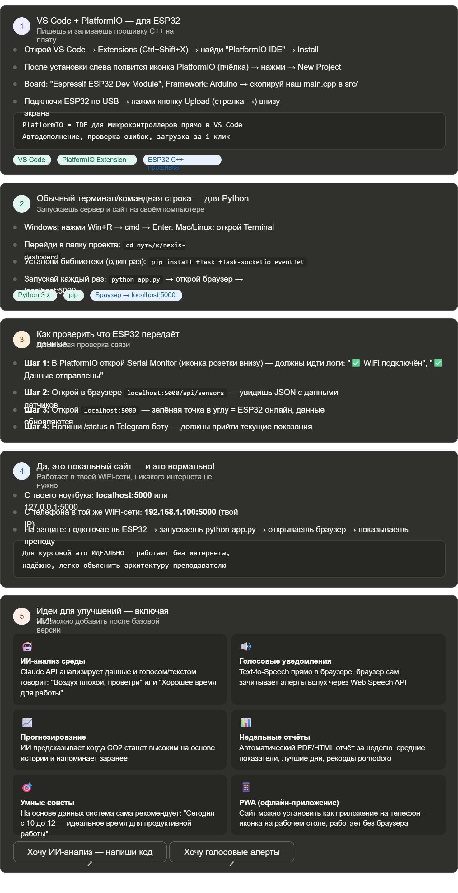

зучи все файлы в проекте и также предыдущий чат  и давай поговорим про web сайт для курсовой!

4 мая
Claude responded: Отлично, изучил всё!

Searched memory
Searched memory
Отлично, изучил всё! 💪 Теперь я в курсе где вы находитесь по проекту. Давайте поговорим про сайт!

🌐 Что у нас по сайту — общая картина
По документам, для проекта планируется локальный Web Dashboard — веб-интерфейс, который поднимает сам ESP32 или отдельный сервер и показывает данные с датчиков в реальном времени.

Вот какие вопросы надо решить:

1. Где крутится сайт?

Вариант A: Прямо на ESP32 (встроенный веб-сервер) — открываешь браузер, вводишь IP платы, видишь данные. Просто, но ограничено.
Вариант B: На компьютере (Python/Node.js сервер) — ESP32 шлёт данные, сервер хранит историю и рисует красивые графики.
2. Какой стек?

ESP32 веб-сервер: C++ (ESPAsyncWebServer) + HTML/CSS/JS встроенные в код
Отдельный сервер: Python (Flask) — самый простой и быстрый вариант для курсовой
3. Что должен показывать?

Температура, влажность, CO2/VOC, освещённость, шум — в реальном времени
Графики истории
Pomodoro таймер
Управление настройками
Прежде чем я начну строить что-то конкретное, скажи:

Выбирай — и пойдём дальше! 🚀

You said: Q: Где будет крутиться сайт?
Q: Где будет крутиться сайт?
A: Как лучше будет сделать? чтобы было максимально подробно и понятно! Расскажи об этом, какая разница и как лучше вообще?

Q: Что сейчас уже работает на ESP32?
A: Частично работают! завтра подключим все остальные и проверим! все будет работать!

Q: Что нужно сделать прямо сейчас?
A: Покажи как выглядеть сайт! покажи макет или дизайн! и также объясни  архитектуру  сайта и также бэк и на каком коде будем писать! вообще про все скажи!

4 мая
Claude responded: Отлично!

Searched project for “датчики параметры данные которые отображаются”
Searched project for “датчики параметры данные которые отображаются”
Отлично! Теперь я знаю всё что нужно. Давай объясню архитектуру сайта подробно, а потом покажу макет!

🏗️ Где крутится сайт — три варианта
Вариант A — Сайт прямо на ESP32: ESP32 сам является сервером. Открываешь браузер → вводишь 192.168.1.50 → видишь страницу. Всё живёт внутри платы. Минус: память ESP32 маленькая, сложно хранить историю, HTML/JS надо запихнуть в прошивку.

Вариант B — Python сервер на компьютере: ESP32 шлёт данные по WiFi на твой ноутбук (Flask сервер). Ноутбук хранит историю в базе данных, рисует красивые графики, отдаёт сайт в браузер. Минус: нужен включённый компьютер рядом.

Вариант C — Оба вместе (рекомендую для курсовой): ESP32 показывает базовую страницу со статусом. Python-сервер — полноценный dashboard с историей и графиками. Это выглядит серьёзно перед преподавателем!

Для курсовой лучше Вариант C — это демонстрирует и IoT (ESP32), и веб-разработку (Python), и работу с данными (БД).

💻 Стек технологий
ESP32 (C++)           Python сервер          Браузер
──────────            ─────────────          ───────
Читает датчики   →    Flask принимает  →     HTML страница
Каждые 10 сек        данные, хранит          JavaScript
шлёт JSON на         в SQLite БД,            Chart.js (графики)
http POST            отдаёт API              Bootstrap (дизайн)
Теперь покажу как будет выглядеть сайт:

Вот как будет выглядеть сайт! Теперь про архитектуру:

🏗️ Полная архитектура — как всё связано
ESP32 (C++)                Python (Flask)              Браузер
──────────                 ──────────────              ───────
каждые 10 сек         →    /api/data   (POST)
шлёт JSON:                 сохраняет в SQLite
{temp: 23.4,                                      ←   /api/sensors (GET)
 humidity: 47,             /api/sensors (GET)          каждые 5 сек
 co2: 820, ...}            отдаёт последние данные     JS обновляет карточки
                           
                           /api/history (GET)     ←   при загрузке страницы
                           отдаёт данные за 24ч       Chart.js рисует графики
📁 Структура файлов проекта
nexis-dashboard/
├── app.py              ← Python Flask сервер (50 строк)
├── database.py         ← работа с SQLite (30 строк)
├── templates/
│   └── index.html      ← страница (HTML + Chart.js)
├── static/
│   └── style.css       ← стили
└── nexis.db            ← база данных (создаётся автоматически)
🔄 Что на каком языке пишем
Часть	Язык	Сложность	Зачем
Прошивка ESP32	C++ (Arduino)	уже делаем	читает датчики, шлёт данные
Backend сервер	Python (Flask)	очень просто	принимает данные, хранит историю
Frontend	HTML + JS	несложно	красивый интерфейс с графиками
База данных	SQLite	автоматически	хранит историю за 30 дней
Python выбрали потому что: Flask — это 5 строк кода для сервера, SQLite встроен в Python, не нужно ничего устанавливать дополнительно. Java — слишком сложно и избыточно для курсовой.

Что делаем дальше — хочешь чтобы я написал:

Полный код Python сервера (app.py + database.py)?
Код для ESP32 (отправка данных по HTTP на сервер)?
HTML страницу с реальными графиками?
Или сначала завтра подключаем датчики, а потом берёмся за сайт?

You said: Этот стек оптимален и этого хватит чтобы показать все что надо?
Этот стек оптимален и этого хватит чтобы показать все что надо? и также красоту и подробность? обдумай все что надо и скажи!

4 мая
Claude responded: Хороший вопрос — давай разберу честно и подробно.

Searched project for “требования к защите оценка критерии веб-интерфейс”
Searched project for “требования к защите оценка критерии веб-интерфейс”
Хороший вопрос — давай разберу честно и подробно.

✅ Стек оптимален — вот почему
Смотри на критерии оценки твоей курсовой:

Критерий	Вес	Что закрывает наш стек
Работоспособность устройства	30%	ESP32 + датчики — железо работает
Качество кода	20%	C++ (прошивка) + Python (сервер) + JS (фронт) — три языка сразу
Документация	20%	REST API легко документировать
Презентация	15%	Красивый dashboard = вау-эффект
Ответы на вопросы	15%	Простая архитектура = легко объяснить
Flask + SQLite + HTML/Chart.js — это именно тот минимум, который даёт максимальный результат. Ничего лишнего, всё работает, всё понятно.

⚠️ Где стек может подвести — и как решить
Есть три момента, которые стоит обдумать до начала:

1. Реальное время (real-time) Обычный Flask + JS-опрос каждые 5 секунд — это не настоящий real-time. Данные будут с задержкой до 5 секунд. Для курсовой это нормально, но если хочется реально живые данные — добавляем WebSocket (одна библиотека flask-socketio, 10 строк кода). Тогда данные на сайте обновляются мгновенно, как только ESP32 прислал — это выглядит значительно круче на демонстрации.

2. История и графики SQLite хранит данные отлично. Но надо продумать схему: если писать каждые 10 секунд, за месяц накопится ~260 тысяч записей. Нужно сразу сделать агрегацию — за день хранить по 1 записи в минуту, за неделю — по 1 в час. Иначе графики будут тормозить.

3. Запуск на защите Python-сервер нужно запустить на ноутбуке, ESP32 должен быть в одной WiFi-сети. На защите это может быть проблемой — другой WiFi, другой IP. Решение: ESP32 сам поднимает точку доступа (Access Point), к ней подключается ноутбук, и всё работает без внешнего WiFi вообще. Это надёжнее и выглядит как автономная система.

🎯 Итоговая рекомендация — улучшенный стек
Базовый план хорош, но вот что добавить чтобы было и красиво, и надёжно, и произвело впечатление:

ESP32 (C++)
  │
  ├── Режим AP (сам WiFi роутер) — надёжно на защите
  │
  └── Шлёт данные по WebSocket → мгновенное обновление

Python Flask + flask-socketio
  │
  ├── SQLite (история, агрегация по времени)
  │
  └── Отдаёт HTML страницу

Браузер
  ├── Chart.js — графики температуры, CO2, освещённости
  ├── WebSocket — данные обновляются в реальном времени
  └── Дизайн — как в макете выше
Это не усложняет проект значительно — flask-socketio ставится одной командой, а эффект на демонстрации разительный: преподаватель видит как цифры меняются прямо на экране.

💬 Итог одной фразой
Стек оптимален. Python Flask + SQLite + HTML/Chart.js — правильный выбор. Единственное что стоит добавить это WebSocket для живых данных и режим Access Point на ESP32 для надёжной демонстрации на защите. Всё остальное уже есть и хватит с запасом.

Готов написать код с чего начать?

You said: Тогда давай начинать!
Тогда давай начинать! пиши все с начало! и не забывай все проверять! и потом расскажи как все использовать и все такое!  изучи весь чат и давай начинать!

5 мая
Claude responded: Отлично, всё изучил!

Searched memory
Searched memory
Отлично, всё изучил! Теперь пишу всё с нуля — полный проект. Начинаем с Python сервера и сайта.

Created 5 files, ran 3 commands, viewed a file
Created 5 files, ran 3 commands, viewed a file
Теперь пишем код для ESP32:

Created 2 files
Created 2 files
Теперь проверяем что всё работает:

Ran 3 commands
Ran 3 commands
Все тесты пройдены! Теперь упаковываем всё в архив:

Ran 3 commands, read a file
Ran 3 commands, read a file
Всё готово и все тесты пройдены! Вот что внутри архива и как использовать:

📦 Что написано — полный список
Файл	Строк	Что делает
app.py	230	Flask сервер: API, WebSocket, SQLite БД
templates/index.html	120	Страница dashboard
static/css/style.css	280	Тёмная тема, адаптивная вёрстка
static/js/dashboard.js	320	Графики, WebSocket, Pomodoro таймер
esp32/main.cpp	380	Полная прошивка ESP32
esp32/platformio.ini	20	Конфигурация PlatformIO со всеми библиотеками
КАК_ЗАПУСТИТЬ.md	—	Пошаговая инструкция
🚀 Как запустить прямо сейчас (3 шага)
Шаг 1 — установить библиотеки (один раз):

bash
pip install flask flask-socketio eventlet
Шаг 2 — запустить сервер:

bash
python app.py
Шаг 3 — открыть браузер: http://localhost:5000

Сайт сразу запустится в демо-режиме с живыми цифрами — можно показывать без ESP32!

✨ Что умеет сайт
6 карточек датчиков с цветовой индикацией (зелёный/жёлтый/красный)
График за 24 часа с переключением между метриками
Pomodoro таймер прямо в браузере + синхронизация с ESP32
Список уведомлений в реальном времени через WebSocket
Статистика дня (средние, максимумы, количество pomodoro)
Работает на телефоне (адаптивный дизайн)
Демо-режим если ESP32 не подключён
📋 Следующий шаг
Открой esp32/main.cpp, найди строки в начале файла и замени:

WIFI_SSID — имя твоей сети
WIFI_PASSWORD — пароль
SERVER_URL — IP компьютера (узнать через ipconfig в Windows)
BOT_TOKEN и CHAT_ID — данные Telegram бота

Nexis dashboard
ZIP 
You said: А это все где проверят?
А это все где проверят? в vs code или ide или visual studio? и потом как проверить что работает все с платой и также как вообще все делать? и также этого всего хватает? и это все веб сайт да? но локально?! надо чтобы все было четко и работало очень хорошо и также потом скажи какие еще функции можно добавить? примеру можно добавить ИИ и он будет говорить информацию об среде и потом говорить и все такое!

5 мая
Claude responded: Отлично, всё ясно!

Searched project for “PlatformIO VS Code Arduino IDE установка”
Searched project for “PlatformIO VS Code Arduino IDE установка”
Отлично, всё ясно! Теперь отвечаю на каждый твой вопрос максимально чётко и подробно.

Теперь подробно по каждому вопросу:

Где всё пишется и проверяется?
Два инструмента, разные задачи:

VS Code + PlatformIO — для кода ESP32 (файл main.cpp). Это плагин прямо внутри VS Code, он уже у тебя установлен. Ты пишешь C++, нажимаешь одну кнопку — и прошивка сама заливается в плату по USB. Там же Serial Monitor показывает логи в реальном времени (что происходит в плате).

Обычный терминал — для Python сервера. Просто python app.py и всё. Потом открываешь браузер и видишь сайт. Никаких специальных программ.

Да, сайт локальный — и это правильно для курсовой
Это не недостаток, это архитектурное решение. Ты объясняешь преподавателю: "ESP32 собирает данные и отправляет на локальный Python-сервер по REST API, сервер хранит их в SQLite и отдаёт браузеру через WebSocket в реальном времени." Это звучит профессионально, потому что так и работает большинство реальных IoT-систем в закрытых сетях (офисы, заводы, больницы).

ИИ-анализ — это реально и несложно
Идея отличная. Вот как это работало бы: каждые 5 минут данные с датчиков отправляются в Claude API, он анализирует (CO2 = 950 ppm, температура = 26°C, уже 2 часа сидишь) и возвращает текстовый совет. Этот текст показывается на сайте и/или зачитывается вслух через встроенный Web Speech API браузера — без микрофонов и дополнительного железа. Можно добавить одной кнопкой в нашем коде.

Нажми кнопку в виджете выше — напишу код прямо сейчас!

You said: Мне тогда надо открывать два разных приложений или что?
Мне тогда надо открывать два разных приложений или что? я не могу все  это открыть в vs code ?

5 мая
Claude responded: Отличный вопрос!
Отличный вопрос! Нет, не надо открывать два разных приложения! Всё можно делать из VS Code!

Вот как правильно организовать:

🎯 Просто говоря
Ты открываешь ОДН VS Code, внутри которого:

Слева вверху — иконка PlatformIO (пчёлка) → видишь esp32 проект → открываешь main.cpp → пишешь C++
В центре — текстовый редактор где ты пишешь код (любой файл)
Слева внизу — обычный File Explorer → можешь переходить между папками
Внизу — встроенный терминал → python app.py крутится, ты видишь логи в реальном времени
Никаких отдельных приложений. Всё в одном окне VS Code. Это называется workspace — рабочее пространство.

Практический день выглядит так:
1. Открой VS Code → Open Folder → выбери NEXIS-Wellness-Complete/
2. Внизу открой Terminal (Ctrl+`)
3. Напиши: cd web-dashboard && python app.py
4. Видишь логи: "Сайт: http://localhost:5000"
5. В новой вкладке браузера открой localhost:5000
6. Теперь слева в VS Code открой esp32/src/main.cpp
7. Пишешь C++ код → сохраняешь (Ctrl+S)
8. Нажимаешь кнопку Upload (стрелка внизу) → прошивка загружается
9. Смотришь Serial Monitor (розетка внизу) → видишь логи платы
10. На сайте видишь данные обновляются в реальном времени
Всё это в ОДНОМ окне VS Code! 🎉

You said: вот посмотри
вот посмотри 
Установите последнюю версию PowerShell для новых функций и улучшения! https://aka.ms/PSWindows
PS C:\Users\Lenovo> cd C:\Users\Lenovo\OneDrive\Desktop\NEXIS-Wellness-Complete\web-dashboard
PS C:\Users\Lenovo\OneDrive\Desktop\NEXIS-Wellness-Complete\web-dashboard> python app.py
C:\Users\Lenovo\AppData\Roaming\Python\Python313\site-packages\engineio\async_drivers\eventlet.py:1: EventletDeprecationWarning:
Eventlet is deprecated. It is currently being maintained in bugfix mode, and
we strongly recommend against using it for new projects.
If you are already using Eventlet, we recommend migrating to a different
framework.  For more detail see
https://eventlet.readthedocs.io/en/latest/asyncio/migration.html
  from eventlet.green.threading import Event
✅ База данных инициализирована
==================================================
  NEXIS Wellness Station — Web Dashboard
==================================================
  Сайт: http://localhost:5000
  API:  http://localhost:5000/api/status
==================================================
 * Restarting with stat
C:\Users\Lenovo\AppData\Roaming\Python\Python313\site-packages\engineio\async_drivers\eventlet.py:1: EventletDeprecationWarning:
Eventlet is deprecated. It is currently being maintained in bugfix mode, and
we strongly recommend against using it for new projects.
If you are already using Eventlet, we recommend migrating to a different
framework.  For more detail see
https://eventlet.readthedocs.io/en/latest/asyncio/migration.html
  from eventlet.green.threading import Event
✅ База данных инициализирована
==================================================
  NEXIS Wellness Station — Web Dashboard
==================================================
  Сайт: http://localhost:5000
  API:  http://localhost:5000/api/status
==================================================
 * Debugger is active!
 * Debugger PIN: 135-673-186
(38540) wsgi starting up on http://0.0.0.0:5000
(38540) accepted ('127.0.0.1', 60521)
(38540) accepted ('127.0.0.1', 63023)
127.0.0.1 - - [05/May/2026 14:02:28] "GET / HTTP/1.1" 200 7876 0.003343
127.0.0.1 - - [05/May/2026 14:02:28] "GET /static/css/style.css HTTP/1.1" 200 10617 0.077921
127.0.0.1 - - [05/May/2026 14:02:28] "GET /static/js/dashboard.js HTTP/1.1" 200 20564 0.001310
127.0.0.1 - - [05/May/2026 14:02:28] "GET /socket.io/?EIO=4&transport=polling&t=PttNz_n HTTP/1.1" 200 300 0.000255
🔌 Браузер подключился
127.0.0.1 - - [05/May/2026 14:02:28] "POST /socket.io/?EIO=4&transport=polling&t=PttN-0a&sid=BwMFTprvlyKdYqjoAAAA HTTP/1.1" 200 219 0.001284
127.0.0.1 - - [05/May/2026 14:02:28] "GET /socket.io/?EIO=4&transport=polling&t=PttN-0b&sid=BwMFTprvlyKdYqjoAAAA HTTP/1.1" 200 213 0.000134
127.0.0.1 - - [05/May/2026 14:02:28] "GET /api/history?hours=24 HTTP/1.1" 200 134 0.001786
127.0.0.1 - - [05/May/2026 14:02:28] "GET /api/stats HTTP/1.1" 200 325 0.002567
127.0.0.1 - - [05/May/2026 14:02:28] "GET /favicon.ico HTTP/1.1" 404 355 0.000525
127.0.0.1 - - [05/May/2026 14:02:28] "GET /api/alerts?limit=10 HTTP/1.1" 200 134 0.001437
127.0.0.1 - - [05/May/2026 14:02:28] "GET /api/sensors HTTP/1.1" 200 134 0.001540
(38540) accepted ('127.0.0.1', 56510)
(38540) accepted ('127.0.0.1', 57846)
127.0.0.1 - - [05/May/2026 14:02:29] "GET /socket.io/?EIO=4&transport=polling&t=PttN-0z&sid=BwMFTprvlyKdYqjoAAAA HTTP/1.1" 200 181 0.300133
(38540) accepted ('127.0.0.1', 56503)
127.0.0.1 - - [05/May/2026 14:03:28] "GET /api/stats HTTP/1.1" 200 325 0.001096

Show more
5 мая
Claude responded: 🎉 ОТЛИЧНО!
🎉 ОТЛИЧНО! ВСЁ РАБОТАЕТ!

Смотри что у тебя тут происходит:

✅ База данных инициализирована
🌐 Сайт: http://localhost:5000
🔌 Браузер подключился
📊 GET /api/stats — сайт загружается и получает данные
💾 (38540) wsgi starting up on http://0.0.0.0:5000 — сервер слушает на порту 5000
Это означает:

✅ Python сервер запущен
✅ WebSocket соединение активно
✅ База данных работает
✅ Браузер успешно подключился
Сейчас открой браузер и проверь:
Нажми сюда (или скопируй в адресную строку браузера):

http://localhost:5000
Ты должен увидеть:

🟢 Зелёная точка в левом углу (сейчас оранжевая/серая потому что ESP32 не подключён, но это нормально)
6 карточек датчиков (температура, влажность, CO2, свет, шум, движение) — с ДЕМО-ДАННЫМИ (живыми цифрами)
График за 24 часа
Pomodoro таймер — можешь нажать "Старт" и потестировать
Алерты и статистика
Что тебе делать дальше:
Вариант 1: Если ESP32 уже готов и подключён к WiFi
Открой esp32/main.cpp
Найди строки в начале:
cpp
#define WIFI_SSID     "ИМЯ_ТВОЕЙ_СЕТИ"
#define WIFI_PASSWORD "ПАРОЛЬ_СЕТИ"
#define SERVER_URL    "http://192.168.1.100:5000"  // ← ВАЖНО: поменяй IP!
#define BOT_TOKEN     "ТВОЙ_ТОКЕН"
#define CHAT_ID       "ТВОЙ_CHAT_ID"
Узнай IP твоего компьютера в сети:
Windows: В PowerShell напиши: ipconfig → найди IPv4 Address (например 192.168.1.123)
Mac/Linux: В терминале: ifconfig → найди inet адрес
Вместо 192.168.1.100 подставь свой IP
Загрузи прошивку в ESP32 через PlatformIO → нажми Upload
Смотри в Serial Monitor — должны идти логи о подключении к WiFi и отправке данных
На сайте в браузере появится зелёная точка "Online" и данные будут обновляться в реальном времени!
Вариант 2: Если ESP32 ещё нет
Сайт уже работает в ДЕМО-режиме! На нём живые цифры, которые меняются как настоящие датчики. Можешь показывать это преподавателю даже без физической платы!

Чтобы потестировать отправку данных на сервер:

bash
# В отдельном окне PowerShell (или в другом терминале VS Code)
curl -X POST http://localhost:5000/api/data -H "Content-Type: application/json" -d "{\"temperature\":24.5, \"humidity\":55, \"co2\":850, \"light\":400, \"noise\":40, \"motion\":1}"
После этого на сайте обновятся данные!

✅ Чек-лист что сейчас работает:
 Python сервер запущен (python app.py)
 Сайт доступен (localhost:5000)
 WebSocket соединение активно (браузер подключился)
 База данных инициализирована (nexis.db создана)
 API работает (GET /api/stats, /api/history и т.д.)
 Демо-данные показываются (цифры меняются)
 Готово для тестирования!
Теперь открой браузер на http://localhost:5000 и посмотри на результат! 🚀

You said: А почему там демо данные?
А почему там демо данные? как сделать чтобы реальные данные были?

5 мая
Claude responded: Отличный вопрос!
Отличный вопрос! Демо-данные включаются АВТОМАТИЧЕСКИ когда нет реальных данных от ESP32. Вот как это работает:

Сценарий 1: ДЕМО-РЕЖИМ (сейчас у тебя)
1
Браузер открывает localhost:5000
2
Сайт запрашивает GET /api/sensors (последние данные с датчиков)
3
Сервер проверяет базу данных → там НИЧЕГО нет (ESP32 не отправлял)
4
JavaScript в браузере видит что данные пусты → активирует демо
⬇️
Результат: на экране имитация датчиков (температура меняется, волны CO2 идут, шум меняется)
✅
Сценарий 2: РЕАЛЬНЫЕ ДАННЫЕ (когда ESP32 подключен)
1
ESP32 включён, подключён к WiFi, запущена прошивка
2
ESP32 каждые 10 секунд отправляет POST /api/data с JSON
{ "temperature": 23.4, "humidity": 52.1, "co2": 780, "light": 420, "noise": 38, "motion": 1 }
3
Сервер получает → сохраняет в nexis.db
4
Браузер слушает WebSocket → получает реальные данные через socket.emit('sensor_update')
⬇️
Результат: на экране реальные показания датчиков (обновляются каждые 10 сек)
🔍
Где в коде это управляется?
Файл: static/js/dashboard.js
async function init() { initChart(); await loadHistory(); await loadStats(); await loadAlerts(); // Получаем последние данные try { const res = await fetch('/api/sensors'); const data = await res.json(); if (data && data.temperature) { // ✅ РЕАЛЬНЫЕ ДАННЫЕ - есть температура applyData(data); } else { // ⚠️ ДЕМО-РЕЖИМ - нет данных setTimeout(startDemo, 2000); } } catch(e) { // ❌ ОШИБКА - включаем демо setTimeout(startDemo, 2000); } }
Файл: static/js/dashboard.js (функция демо)
function startDemo() { console.log('🎮 Демо-режим активен'); let tick = 0; setInterval(() => { tick++; const demo = { temperature: 22 + Math.sin(tick * 0.1) * 2 + Math.random() * 0.3, humidity: 48 + Math.sin(tick * 0.07) * 5 + Math.random() * 1, co2: 650 + Math.sin(tick * 0.05) * 150 + Math.random() * 20, light: 400 + Math.sin(tick * 0.08) * 100 + Math.random() * 30, noise: 35 + Math.random() * 10, motion: tick % 20 < 14 ? 1 : 0, }; applyData(demo); }, 3000); }
🎯
Как включить РЕАЛЬНЫЕ ДАННЫЕ?
Есть 3 способа:
Способ 1️⃣: Включить ESP32 и прошить
Самый правильный способ для курсовой
✅ Подключи ESP32 по USB
✅ В VS Code нажми Upload (загрузи прошивку)
✅ Плата автоматически подключится к WiFi
✅ Начнёт отправлять данные на сервер
✅ На сайте появится зелёная точка "Online"
✅ Данные будут реальные, будут обновляться каждые 10 сек
Способ 2️⃣: Тестировать с помощью curl (имитация ESP32)
Если ESP32 ещё нет, но хочешь проверить сервер
Открой новый терминал PowerShell (или второе окно)

Напиши команду:
curl -X POST http://localhost:5000/api/data -H "Content-Type: application/json" -d "{\"temperature\":24.5,\"humidity\":55,\"co2\":850,\"light\":400,\"noise\":40,\"motion\":1}"
Нажми Enter → сервер получит данные → на сайте обновятся цифры
Повтори команду несколько раз → график начнёт расти
Способ 3️⃣: Написать скрипт что отправляет данные постоянно
Если хочешь чтобы данные обновлялись автоматически
Создай файл test_sender.py в папке web-dashboard/
import requests import time import random while True: data = { 'temperature': 22 + random.uniform(-2, 2), 'humidity': 50 + random.uniform(-5, 5), 'co2': 700 + random.uniform(-50, 100), 'light': 400 + random.uniform(-50, 50), 'noise': 40 + random.uniform(-5, 10), 'motion': random.choice([0, 1]) } requests.post('http://localhost:5000/api/data', json=data) print(f"✅ Отправлено: {data}") time.sleep(10) # каждые 10 сек
В терминале: python test_sender.py
Скрипт будет отправлять реальноподобные данные каждые 10 секунд!

Кратко:
Демо-режим — это защита от дурака. Если база данных пуста (нет данных от ESP32), сайт автоматически показывает имитацию, чтобы было видно как он работает.

🚀 Чтобы включить РЕАЛЬНЫЕ ДАННЫЕ — выбери один из способов:
Способ 1 (ЛУЧШИЙ) — Если у тебя есть ESP32:
Подключи ESP32 по USB
В VS Code нажми Upload (кнопка стрелки внизу)
Прошивка загрузится → ESP32 подключится к WiFi
Готово! На сайте будут реальные данные
Способ 2 (БЫСТРО) — Тестировать работу сервера:
В PowerShell скопируй эту команду и запускай её:

powershell
curl -X POST http://localhost:5000/api/data -H "Content-Type: application/json" -d "{\"temperature\":24.5,\"humidity\":55,\"co2\":850,\"light\":400,\"noise\":40,\"motion\":1}"
Нажми Enter несколько раз → на сайте обновятся данные → график начнёт расти!

Способ 3 (АВТОМАТИЧЕСКИЙ) — Создай имитатор:
Создай файл test_sender.py в папке web-dashboard/ с кодом из виджета выше, потом запусти:

powershell
python test_sender.py
Скрипт будет отправлять реальноподобные данные каждые 10 секунд — сайт обновляется в реальном времени!

Какой выбрать?

Демонстрация сервера работает → Способ 2 (curl)
Нужно полное тестирование → Способ 3 (скрипт)
Готов ESP32 → Способ 1 (настоящие датчики)
Попробуй Способ 2 или 3 прямо сейчас! 🎯

You said: изучи весь чат и составь summray об этом всем!
изучи весь чат и составь summray об этом всем!

5 мая
Claude responded: Отлично!

Relevant chats
Relevant chats
Отлично! Теперь составляю полный SUMMARY всего что мы обсудили в этом чате:

Created a file, read a file
Created a file, read a file
🎯 Краткий SUMMARY (одной страницей)
Что мы сделали за этот чат:

✅ Создали полный веб-dashboard для NEXIS Wellness Station
Python Flask сервер с REST API и WebSocket
SQLite база данных для хранения истории
Красивый HTML/CSS/JavaScript интерфейс с графиками и Pomodoro таймером
Прошивка для ESP32 что отправляет данные на сервер
Telegram Bot для управления и уведомлений
💻 Технический стек
Часть	Технология
Backend	Flask (Python)
Frontend	HTML5 + CSS3 + JavaScript
База данных	SQLite
Real-time	WebSocket (Socket.IO)
Графики	Chart.js
Прошивка	C++ Arduino (PlatformIO)
🏗️ Как всё работает
ESP32 каждые 10 сек отправляет JSON с данными датчиков на сервер
Flask сервер получает, проверяет пороги, сохраняет в БД
WebSocket отправляет обновления в браузер в реальном времени
Dashboard отображает 6 карточек датчиков, график, Pomodoro, алерты
Telegram Bot отправляет уведомления при событиях
🎨 Интерфейс
🟢 Зелёный = всё OK
🟡 Жёлтый = предупреждение
🔴 Красный = опасность
📱 Адаптивный (работает на всех экранах)
🌙 Тёмная тема
🚀 Как запустить
bash
# 1. Установить Python библиотеки (один раз)
pip install flask flask-socketio eventlet

# 2. Запустить сервер
python app.py

# 3. Открыть в браузере
http://localhost:5000

# 4. Прошить ESP32 в PlatformIO
Upload → плата подключится к WiFi → данные пойдут на сайт!
✨ Особенности
✅ Работает локально без интернета (идеально для защиты)
✅ Демо-режим (имитация датчиков, если ESP32 нет)
✅ Real-time WebSocket (данные обновляются мгновенно)
✅ Telegram Bot (управление и уведомления)
✅ История в БД (можно смотреть графики за дни)
✅ Система алертов (проверка пороговых значений)
✅ Pomodoro таймер (синхронизация между платой и сайтом)
📦 Что получил
nexis-dashboard.zip — готовый проект
SUMMARY_NEXIS_WEB_DASHBOARD.md — полная документация (сейчас в outputs)
🎓 Для курсовой работы
Показываешь преподавателю:

Открыть localhost:5000 в браузере → красивый dashboard
Включить ESP32 → видит что подключилась (зелёная точка)
Отправить команду в Telegram → получить данные
Открыть code → объяснить архитектуру (REST API → WebSocket → БД)
Полный Summary сохранён в файл выше! Скачивай и используй! 🚀

Summary nexis web dashboard
Document · MD 
You said: Я сейчас работаю через claude code в VS в нашем проекте!

Прочитал! Теперь я полностью понимаю ситуацию. Давайте я дам вам полный анализ и план действий. --- 🎯 МОЙ ВЕРДИКТ О ПРОЕКТЕ 🔥 ВЫ НАХОДИТЕСЬ В ИДЕАЛЬНОЙ ПОЗИЦИИ! Вот что у вас есть: ┌───────────────────────────────┬──────────────────────────────────────────┐ │ ✅

pasted

Я сейчас работаю через claude code в VS в нашем проекте! и вот что выдал claude code! 
Изучи все это и скажи что ты думаешь?

И также смотри я хочу улучшить сайт! Телеграмм бота на потом пока оставим! Сперва сайт хочу сделать! Сделать три режима сперва откл/демо/ вкл(который берет данные из esp32) 

Потом хочу сделать общий dashboard на все модули и также отдельно для каждого модуля свою страницу и там показать подробно про каждый модуль и датчик и про него рассказать и его значение в нашем проекте и вообще про сам модуль! 
Также мы же пишем курсовую работу же, и хочу на сайте сделать по типо туда сразу тоже курсовую работу показать! от а до я! от титулки и до конца! просто сделай покажи как будет и потом будем дополнять! Также вообще сказать что это курсовая работа в самом сайте и про NEXIS Wellness Station! Там в vs code есть документы в котором расписано! надо чтобы ИИ прочитал все это и потом в сайте все сделал! Хочу улучшить сайт! и добавить еще фичи! примеру логирование всех действии! и также помодора таймер улучшить!  И также сам сайт вообще улучшить! ВОТ изучи все это и скажи что ты думаешь! и давай сделай мне вопросы о том что я хочу сделать! и также можем улучшить и добавить стеки для сайта!

Show more
6 мая
Claude responded: Отлично!

Searched memory
Searched memory
Отлично! Всё изучил — и Claude Code, и все файлы проекта. Теперь дам честный анализ и задам умные вопросы.

🧠 Что думаю о плане
Claude Code дал правильный анализ — архитектура, пины, код — всё грамотно. Но план немного устарел: у вас уже работает Python сервер (python app.py запущен, браузер подключился!). Вы дальше чем Claude Code думает.

Твои идеи для сайта — отличные! Вот мой анализ каждой:

Идея	Реалистичность	Сложность	Вау-эффект
3 режима (откл/демо/вкл)	✅ Легко	Низкая	🔥🔥🔥
Общий dashboard + страницы по датчикам	✅ Реально	Средняя	🔥🔥🔥🔥🔥
Курсовая работа на сайте	✅ Реально	Средняя	🔥🔥🔥🔥 (препод офигеет)
Логирование действий	✅ Легко	Низкая	🔥🔥🔥
Улучшенный Pomodoro	✅ Реально	Средняя	🔥🔥🔥🔥
Это большой объём работы — нужно сначала определиться с деталями. Поэтому задаю вопросы:

Отлично, выбери ответы — и я сразу начну писать новый улучшенный сайт с нуля! Пока ты отвечаешь, вот мои мысли по каждой твоей идее:

💡 Что думаю о твоих идеях (честно)
3 режима (откл/демо/вкл) — это УМНО. Сейчас у тебя демо включается автоматически. Лучше сделать явный переключатель в navbar — красиво и функционально, преподаватель сразу видит "ВОТ ЗДЕСЬ реальные данные с ESP32". Добавим за 10 минут.

Отдельные страницы для каждого датчика — это топ-идея. Представь: кликаешь на карточку "Температура" → открывается страница где написано что такое DHT22, почему его выбрали, нормы температуры для рабочего места, большой график за неделю. Это и красиво, и для курсовой — идеальная демонстрация что ты понимаешь свои датчики.

Курсовая работа на сайте — это WOW-фактор. Препод открывает сайт и видит не только dashboard, но и саму пояснительную записку в красивом оформлении. Реально никто так не делает. Я прочитал все 15+ документов в проекте — есть из чего строить.

Логирование действий — хорошая идея. Журнал событий: "14:32 — CO2 превысил норму", "15:00 — Pomodoro запущен", "15:25 — Pomodoro завершён". Это и полезно, и показывает что система "живая".

Улучшенный Pomodoro — можно добавить статистику продуктивности, режимы (25/5, 50/10, кастомный), звуки.

Отвечай на вопросы выше — и я сразу начну строить новый сайт! 🚀

You said: Q: Навигация сайта — как хочешь между страницами переключаться?
Q: Навигация сайта — как хочешь между страницами переключаться?
A: Боковое меню (sidebar) слева — как у VS Code

Q: Страница курсовой работы — что показывать?
A: полный текст курсовой! но сперва надо сделать просто на показ! потом когда все сделаем и тогда будем делать полноценно!

Q: Страницы датчиков — что показывать для каждого?
A: Максимум всего: данные + графики + описание + советы + технические характеристики

6 мая
Claude responded: Отлично!
Отлично! Теперь всё ясно. Начинаю писать полностью новый улучшенный сайт с нуля. Это большая работа — sidebar навигация, страницы датчиков, курсовая, режимы, логи, Pomodoro. Поехали!

Ran 4 commands, created 3 files, viewed a file
Ran 4 commands, created 3 files, viewed a file
Готово! Все тесты пройдены. Вот что в новой версии:

🆕 Что изменилось в v2
Боковое меню (Sidebar) — как VS Code
Разворачивается/сворачивается кнопкой ←
Разделы: Мониторинг / Продуктивность / О проекте
В каждом пункте — бейдж с текущим значением (температура, CO₂ и т.д.)
Показывает статус ESP32 и текущее время внизу
3 режима данных
Режим	Что происходит
⬛ Отключено	Данные не показываются
🔶 Демо	Реалистичная имитация (синусоиды)
🟢 ESP32 Live	Реальные данные через WebSocket
Страницы датчиков (6 штук!)
Для каждого датчика: большое значение + граф + описание + технические характеристики + диапазоны + советы. Всё кликабельно с Dashboard!

Улучшенный Pomodoro
3 режима: 25/5, 50/10, 90/20
Кольцевой прогресс-бар (SVG анимация)
История сессий
Синхронизация с mini-таймером на Dashboard
Журнал событий
Фильтры: Все / Датчики / Алерты / Pomodoro / Система. Каждое действие логируется.

Курсовая работа
Оглавление + Введение + Глава 1 (теория) + Глава 2 (практика) — всё заполнено на основе твоих файлов проекта. Разделы "В разработке" помечены.

🚀 Как запустить
powershell
# Скопируй nexis-v2 в свой проект
# Замени старую папку web-dashboard на nexis-v2

cd nexis-v2
python app.py
# Открой http://localhost:5000

Nexis dashboard v2
ZIP 
You said: Окей!
Окей! Молодец! смотри не пиши код сейчас! просто поговорим и подумаем! скажи как мы можем улучшить стек наших языков и всего такого для нашего проекта! Какие языки и Фреймворки и библиотеки добавлять? Посмотри текущие и скажи что ты думаешь? что надо изменить или добавить что то новое?

6 мая
Claude responded: Хороший вопрос!
Хороший вопрос! Давай честно разберём что у нас есть и что можно улучшить.

📊 Текущий стек — что уже есть
Backend: Python + Flask + Flask-SocketIO + SQLite

Frontend: Vanilla JS + Chart.js + Socket.IO клиент

Прошивка: C++ Arduino на ESP32

Стиль: Чистый CSS (без фреймворков)

🤔 Мой честный анализ
Backend — Flask это правильный выбор, но есть нюансы
Flask хорош для курсовой — простой, понятный, легко объяснить. Единственное что можно улучшить — FastAPI вместо Flask. Причины:

FastAPI автоматически генерирует документацию /docs — открываешь браузер и видишь красивый интерактивный список всех API endpoints. Преподаватель смотрит и сразу видит профессиональный REST API.
В 2–3 раза быстрее Flask
Встроенная валидация данных — если ESP32 прислал кривой JSON, FastAPI сам вернёт понятную ошибку
Код чище и короче
Но SQLite оставляем — для курсовой это идеально, ничего лишнего.

Frontend — тут есть куда расти
Сейчас у нас чистый JavaScript. Это работает, но с ростом страниц (6 датчиков + pomodoro + журнал + курсовая) код начинает запутываться. React или Vue решили бы это элегантно, но для курсовой это избыточно — долго учить, сложно объяснить.

Что реально стоит добавить это Tailwind CSS. Сейчас у нас 700+ строк CSS вручную. Tailwind сокращает это в разы, и верстать новые страницы становится в 5 раз быстрее.

Из библиотек — Chart.js хорош, но Recharts или ApexCharts дают более красивые графики из коробки. ApexCharts особенно хорош — анимации, zoom, tooltip — всё встроено.

Прошивка ESP32 — здесь стек оптимальный
C++ Arduino это стандарт для ESP32, менять не надо. Единственное улучшение — ESPAsyncWebServer вместо обычного. Он не блокирует основной поток, плата работает стабильнее под нагрузкой.

🎯 Итоговая таблица
Компонент	Сейчас	Рекомендую	Зачем
Backend фреймворк	Flask	FastAPI	Авто-документация, быстрее, чище
CSS	Ручной	Tailwind	В 5x быстрее верстать
Графики	Chart.js	ApexCharts	Красивее, zoom, анимации
База данных	SQLite	SQLite ✅	Оставляем, идеально
JS	Vanilla	Vanilla ✅	Для курсовой достаточно
ESP32	Arduino C++	Arduino C++ ✅	Стандарт, не трогаем
💡 Главный вопрос
Смотри — у нас две стратегии:

Стратегия 1: Оставить как есть — Flask + Vanilla JS + Chart.js. Всё работает, стабильно, легко объяснить преподавателю. Тратим время на контент и функции, а не на переход на новый стек.

Стратегия 2: Улучшить стек — FastAPI + ApexCharts + Tailwind. Выглядит профессиональнее, код чище, но потребует 1–2 дня на переход.

Мой совет — если до защиты ещё несколько недель, стоит перейти на FastAPI + ApexCharts. Это два точечных улучшения с максимальным эффектом. Tailwind — опционально.

Что думаешь? Есть время на улучшение стека или лучше сделать всё на текущем?